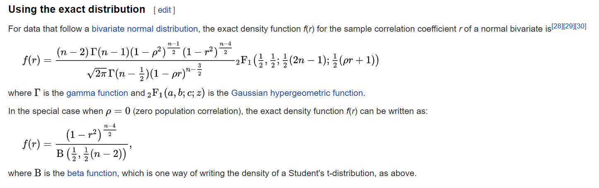

```{r setup, include=FALSE, purl=FALSE}
knitr::opts_chunk$set(echo = TRUE, eval = TRUE, comment= ' ',warning=FALSE, message=FALSE, fig.show='asis',results='markup', fig.width=6.5, fig.height=3.5, fig.align='center',  linewidth=60, tidy=TRUE, tidy.opts=list(width.cutoff=60))


local({r <- getOption("repos"); r["CRAN"] <- "http://R.research.att.com"; options(repos=r)})
```

# Bootstrap using R 

---
## Bootstrap vs. CV 

-  Cross-validation: provides estimates of the (test) error

- The Bootstrap: provides the (standard) error of estimates

---
## Bootstrap 

- *Group of metaphors which refer to a self-sustaining process that proceeds without external help.*

- In Statistics, Bootstrap is a procedure that helps us get an idea about the distribution of a test statistic by resampling from the sample that produces the statistic. 

- Introduced by Brad Efron in 1979 - spread like a bushfire in scientific disciplines within a couple of decades. 


---
## Motivation 

-  Goal: *Summarize* a sample based study and *generalize* the finding to the parent population, using sample statistics are sample mean, sample median, sample standard deviation etc.
	
- Sample mean will fluctuate from sample to sample and we would like to know *the magnitude of these fluctuations* around the corresponding population parameter in an overall sense. 

-  This is then used in assessing the Margin of Errors. 

- The entire picture of all possible values of a sample statistics presented in the form of a probability distribution is called a *sampling distribution.*

---
## Sampling distributions 

-  There is a plenty of theoretical knowledge of sampling distributions for some common statistics, which can be found in any text books of mathematical statistics.  

- For example,

  + Normal: $\mathcal {N}(\mu ,\sigma ^{2})$ $\Rightarrow$ Sample mean $\bar {X}$ from samples of size n	$\Rightarrow$ $\bar  X \sim {\mathcal  {N}}{\Big (}\mu ,\,{\frac  {\sigma ^{2}}{n}}{\Big )}$
  + Bernoulli: $\operatorname {Bernoulli}(p)$ $\Rightarrow$	Sample proportion of "successful trials" $\bar {X}$ $\Rightarrow$	$n{\bar  X} \sim \operatorname {Binomial}(n,p)$
  + Similarly, you can find sampling distribution for difference of two normal means (used in hypothesis testing).
  + But, sometimes the sampling distribution is way too complicated or not available in a closed form even for simple test statistics. 
  + e.g. Pearson's correlation coefficient 
  

---
## Sampling distribution of $r$ 

```{r, echo = F, eval = TRUE}

```


-  TL;DR: sampling distributions are not always easy to derive / admit a 'nice' closed form probability density. 
-  A general intuitive method applicable to just about any kind of sample statistic without the technical tedium has got its own special appeal. 
-  Bootstrap is such a method.


---
## Bootstrap

- To understand bootstrap, suppose it were possible to draw repeated samples (of the same size) from the population of interest, a large number of times. 

>- For example, if you want to know about distribution of $\bar{X}$, where $X_1, \ldots, X_n$ are from $N(\mu,\sigma^2)$, you can do so by drawing many independent samples of size $n$ from $N(\mu,\sigma^2)$, and see how $\bar{X}$ from different samples behave. 

>- For any statistic, one would get a fairly good idea about the sampling distribution of a particular statistic from the collection of its values arising from these repeated samples.

>- But, that does not make sense *as it would be too expensive and defeat the purpose of a sample study*. The purpose of a sample study is *to gather information cheaply in a timely fashion.*

---
## Main idea 

- The idea behind bootstrap is to use the sample at hand as a
_surrogate population_, for the purpose of approximating the
sampling distribution of a statistic.
- We resample (with replacement) from the sample data at hand and create a large number of "phantom samples" known as bootstrap samples.
- Sample with replacement: 
 + you have a box with n balls with n values, you 1) choose a ball at random 2) note it's number, 3) put it back,
and 4) repeat. 
  + (This is called an SRSWR: Simple Random Sample
With Replacement).
- The sample summary is then computed on each of the bootstrap
samples (usually a few thousand).
- A histogram of the set of these computed values is referred to as the bootstrap distribution of the statistic.

---
class: center, middle

# Let's try Bootstrap for a simple problem 

---
## Sampling distribution 

- If the population distribution is known, we can sample from it many times to get an idea of the sampling distribution. 

- Example: $X_i \sim N(\mu, \sigma^2), i = 1, \ldots, n$. 
- Sampling distribution of $\bar{X}$ is $N(\mu, \sigma^2/n)$
- Also, we can draw from normal many times, and plot the histogram of all the means. 

---
## Sampling distribution Normal mean

```{r, echo = TRUE, fig.height = 3}
set.seed(123)
x = rnorm(100,2,3)
xbar.smpls = rep(NA, 1000)
for (i in 1:1000)  xbar.smpls[i] = mean(rnorm(100,2,3))
hist(xbar.smpls, freq = FALSE)
curve(dnorm(x,mean=2,sd=3/10),add=T)
```

---
## Use of sampling distribution
-  We can use the sampling distribution to get an idea about the fluctuation of the sample mean etc.
- The true sampling mean should be 2, and true sampling std. dev. should be $\sigma/\sqrt{n}= 3/\sqrt(100) = 0.3$.

```{r, echo = TRUE}
mean(xbar.smpls)
sd(xbar.smpls)
```

---
## Bootstrapping the sample mean 

-  Now, we will find the bootstrap estimate of the sampling distribution of the sample mean, 
-  But, before that, let's introduce a little bit of formalism to help us. 


---
## Algorithm 

1.  Data: $X_1, \ldots, X_n$. Test statistics $t_n$ (e.g. $\bar{X}$)
2.  Draw $B$ samples $x_1^b, x_2^b, \ldots, x_n^b$ with replacement $b = 1, \ldots, B$ (there might be ties). This is called a **Bootstrap sample**!
3.  For each of the $B$ samples calculate the statistic $t_n^b$.
4.  Use these $B$ realizations of $t_n$ to compute whatever you want, e.g. 
-   mean: $E(t_n) \approx 1/B \sum_b t_n^b$.
-   variance: $Var(t_n) \approx 1/(B-1) \sum_b (t_n^b - \bar{t}_n)^2$.
-   Empirical CDF $\hat{F}(t_n)$. 


---
## Bootstrap in R - the sample() function 

A major component of bootstrapping is being able to resample a given data set and in R the function which does this is the sample function.

sample(x, size, replace, prob)

-  The first argument is a vector containing the data set to be resampled or the indices of the data to be resampled.
-  The size option specifies the sample size with the default being the size of the population being resampled.
-  The replace option determines if the sample will be drawn with or without replacement where the default value is FALSE, i.e. without replacement. 
-  The prob option takes a vector of length equal to the data set given in the first argument containing the probability of selection for each element of x. 

---
## More on sampling - 1
-  Using sample to generate a permutation of the sequence 1:10
```{r, echo = TRUE}
sample(10)
```
-  Bootstrap sample from the same sequence (ties)
```{r, echo = TRUE}
sample(10, replace=T)
sample(10, replace=T)
```

---
## More on sampling - 2

-  Boostrap sample from the same sequence with probabilities that favor the numbers 1-5
```{r, echo = TRUE}
prob1 <- c(rep(.15, 5), rep(.05, 5))
prob1
sample(10, replace=T, prob=prob1)
```

---
## Bootstrap in R 
- Here is an R code for getting the bootstrap samples from the same $x$ that we saw before. 

```{r, echo = TRUE, cache = TRUE, fig.height= 2}
B = 5000
theta.boot = rep(0, B)
n = length(x)
for (b in 1:B)  theta.boot[b] = mean(sample(x,replace=TRUE))#<<

```


-  Pay attention to what that single line of code is doing: it's sampling from the same observations $x$ multiple (5000) times, then calculating the mean for each such *resample* and storing them in a vector called `theta.boot` 

- To estimate the standard errors of $\bar{x}$, we just need to calculate the mean and s.d. of these bootstrap samples. 


---
## Bootstrap mean and sd

-  We can use the statistics calculated from the bootstrap distribution to get an idea about the fluctuation of the sample mean etc. when the true F is not known.

```{r, echo = TRUE}
mean(theta.boot)
sd(theta.boot)
```

---
## The bootstrap distribution 

```{r, echo = TRUE}
hist(theta.boot, breaks = 30, col = rgb(0,1,0,0.5), freq = FALSE)
hist(xbar.smpls, breaks = 30, col = rgb(0,0,1,0.5), freq = FALSE, add = TRUE)
abline(v=mean(xbar.smpls),lty="dotted")
abline(v=mean(theta.boot))
legend("topright",c("Bootstrap","Sampling dist"),col =c(rgb(0,1,0,0.5),rgb(0,0,1,0.5)), lty = c(2,2), lwd = c(4,4))
```

---
## Bootstrap theory 

-  You have data $X_1, \ldots, X_n$, realizations from a distribution $F$.
-  If $F$ is completely unknown, we cannot generate random numbers from this distribution. 
-  Your only source of information is your data at hand: $X_1, \ldots, X_n$. 

--
-  The idea is to approximate $F$ by $\hat{F}_n$ based on $X_1, \ldots, X_n$. This is called an empirical CDF. 

-  Basic idea: Inference about a population from sample data, (sample $\rightarrow$ population), can be modeled by resampling the sample data and performing inference about a sample from resampled data, (resampled $\rightarrow$ sample).

---
## Empirical CDF 

- The EDF $F_n$ is defined as $F_n(x) = \frac{1}{n} \sum_{i=1}^{n} I\{ X_i \le x\}$.
- Glivenko-Cantelli Lemma: EDF converges to the true CDF, i.e. $F_n$ converges to $F$ as $n \to \infty$. 
- Since the Bootstrap samples are resamples from the given sample, we can think of bootstrap samples as draws from the Empiricial Distribution Function. 

>- The population is to the sample as
>- the sample is to the bootstrap samples. (John Fox)

---
class: center, middle, dark
## G-C Lemma: Empirical CDF converges to the *true CDF*

[https://jdatta.shinyapps.io/eCDFdemo/](https://jdatta.shinyapps.io/eCDFdemo/)

---
## Bootstrapping median - 0

-  Taken entirely from [ATS UCLA website](http://www.ats.ucla.edu/stat/r/library/bootstrap.htm) 
- In the following bootstrapping example we would like to obtain a standard error for the estimate of the median. 

- We will use the `lapply` and `sapply` functions. 

- `lapply(X, FUN, ...)`: returns a list of the same length as X, each element of which is the result of applying FUN to the corresponding element of X.
- `sapply(X, FUN, ...)` is a user-friendly version and wrapper of lapply by default returning a vector, matrix or, if `simplify = "array"`, an array if appropriate.

---
class: center, middle

# Example 2: Bootstrapping the median. 

>- (The exact expression for the sampling distribution of the sample median is not available in closed form.)


---
## Bootstrapping median - 1

-  We want to calculating the standard error of the median for a data set created by taking 100 observations from a normal distribution with mean 5 and stdev 3. 

-  The distribution of median is not as simple as the mean.

```{r, echo = TRUE}
data <- rnorm(100, 5, 3)
data[1:10]
```


---
## Bootstrapping median - 2
- We will generate only 20 bootstrap samples. 
- Show the first sample for demonstration. 

```{r, echo = TRUE}
resamples <- lapply(1:20, function(i)
sample(data, replace = T))
resamples[1]
```


---
## Bootstrapping median - 3

- For each bootstrap samples, we will calculate the median. 
- Now we have a bootstrap sample from the distribution of the sample median, and we can use it to calculate the standard deviation. 
```{r, echo = T}
r.median <- sapply(resamples, median)
r.median
sqrt(var(r.median))
```


---
## Bootstrapping median - 4

```{r, echo = T}
hist(r.median, freq = FALSE, col = rgb(0,1,0,0.5))
```

---
## Using package 

Bootstrap the 95% CI for $R^2$ statistic. 

First need function to obtain R-Squared from the data 

```{r, echo = T, cache = T}
rsq <- function(formula, data, indices) {
  d <- data[indices,] # allows boot to select sample 
  fit <- lm(formula, data=d)
  return(summary(fit)$r.square)
} 
```

Botstrapping with 1000 replications:

```{r, echo = TRUE, warning = FALSE, message = FALSE}
library(boot)
results <- boot(data=mtcars, statistic=rsq, 
  	R=1000, formula=mpg~wt+disp)
```

---
## Using package 

```{r, echo = TRUE} 
# view results
results
```

---
## Using package 

You can also get them separately:
```{r, echo = TRUE}
(bs.median = results$t0)
(bs.stderr = sqrt(var(results$t)))
```

---
## Plotting results 

```{r, echo = TRUE}
plot(results)
```

---
## Plotting results 

```{r, echo = TRUE, fig.height = 3}
df <- data.frame(x = results$t); x<- df$x
library(ggplot2)
ggplot(df, aes(x)) + geom_histogram(aes(y = ..density..),alpha = 0.5)+
geom_density()
```

---
## Law data example 

```{r, echo = TRUE, fig.height=3}
setwd("~/GitHub/DattaHub.github.io/cube")
load("law.rda")
attach(law)
library(ggplot2)
qplot(LSAT, GPA, data = law) + theme_bw()
cor(LSAT, GPA)
```

---
## Sample with replacement 

```{r, echo = TRUE}
sample(nrow(law), replace = TRUE)

sample(nrow(law), replace = TRUE)

with(law[sample(nrow(law), replace = TRUE), ], cor(LSAT, GPA))

with(law[sample(nrow(law), replace = TRUE), ], cor(LSAT, GPA))

with(law[sample(nrow(law), replace = TRUE), ], cor(LSAT, GPA))
```

---
## Bootstrap (Long code)

```{r, echo = TRUE, cache = TRUE}
ptm <- proc.time()
B <- 5000
cor.boot <- rep(0,B)
for (b in 1:B){
  law.boot <- law[sample(nrow(law), replace = TRUE), ]
  cor.boot[b] = cor(law.boot$LSAT, law.boot$GPA)
}
summary(cor.boot)
proc.time()-ptm
```

---
## Bootstrap (Short code)

```{r, echo = TRUE, cache = TRUE}
ptm <- proc.time()
B <- 5000
cors <- replicate(B, {with(law[sample(nrow(law), replace = TRUE), ], 
                           cor(LSAT, GPA))})
summary(cors)
proc.time()-ptm
```

- Slight gain in running time! Gets better with bigger data.

---
## Plotting results 

```{r, echo = TRUE, fig.height = 3}
df <- data.frame(x = cors); x<- df$x
library(ggplot2)
ggplot(df, aes(x)) + geom_histogram(aes(y = ..density..), binwidth = 0.1, alpha = 0.5)+geom_density()+theme_bw()
```


---
## How many bootstrap samples do we need? 

- We will perform Bootstrap sampling for different values of $B$, the number of Bootstrap samples and observe the fluctuation between bootstrap estimates for each choice. 

- Our preferred $B$ should lead to a low variation.

- We will show the standard loop-y code, which is not efficient and a fast code. 


---
## Design 

```{r, echo = TRUE, cache = TRUE}
Bs <- rep(100 * (1:50), 3)
Bs
```

---
## How many bootstrap samples do we need? 

```{r, echo = TRUE, cache = TRUE}
ptm <- proc.time()
corsize = matrix(0,length(Bs),2)
for (i in 1:length(Bs)){
  b = Bs[i]
  cor.boot <- numeric(b)
  for (j in 1:b){
   law.boot <- law[sample(nrow(law), replace = TRUE), ]
   cor.boot[j] = cor(law.boot$LSAT, law.boot$GPA)
  }
  corsize[i,] = c(b, mean(cor.boot))
}
colnames(corsize) = c("B","cor")     
proc.time()-ptm
```


---
## How many bootstrap samples do we need? 

```{R, highlight.output = 3:4}
head(corsize, n = 6)
```


---
## Plot

- Plot the correlation estimates for each value of $B$ for three choices. 
- As $B$ increases, fluctuation diminishes. 

```{r,echo = TRUE, fig.height = 3}

qplot(B, cor, data = data.frame(corsize)) + theme_bw()
```

---
## Exercise 

We will now derive the probability that a given observation is part of a bootstrap sample. Suppose that we obtain a bootstrap sample from a set of $n$ observations.

-  What is the probability that the first bootstrap observation is not the $j^{th}$ observation from the original sample? Justify your answer.

-  What is the probability that the second bootstrap observation is not the $j^{th}$ observation from the original sample?

-  Argue that the probability that the $j^{th}$ observation is not in the bootstrap sample is $(1 - 1/n)^n$.

-  As $n$ becomes larger and larger, (i.e. $n \to \infty$), where will this probability $(1 - 1/n)^n$ converge? You can get an idea by plotting $(1 - 1/n)^n$ as a function of $n$ for a long sequence. 

---
## Exercise 2 

Example 29.4 in DasGupta (2008). 

Suppose $X_1, \ldots, X_n$ are IID samples from a Cauchy distribution [(Wiki)](https://en.wikipedia.org/wiki/Cauchy_distribution) with location $\mu$. The sample mean $\bar{X}$ is a bad estimator of $\mu$ (Cauchy distribution has infinite moments, i.e. the mean or variance of Cauchy does not exist}), so use the sample median $M_n$ instead. 
Now, the exact formula for the variance of a Cauchy median exists for an odd $n$, and is given by:

$$
\begin{equation}
V\left(M_{n}\right)=\frac{2 n !}{(k !)^{2} \pi^{n}} \int_{0}^{\pi / 2} x^{k}(\pi-x)^{k}(\cot x)^{2} d x
\end{equation}
$$

Your task is to derive the Bootstrap approximation for the variance of the median.What is your bootstrap estimate $\widehat{V(M_n)}_{boot}$? 

You can use `rcauchy(n)` to generate $n$ samples from the Cauchy distribution. 

---
## References

-  [Chapter 5, Introduction to Statistical Learning with R, James et al. (first edition)](https://www.statlearning.com/)
- ["Bootstrap: An Exploration", Datta and Ghosh, Statistical Methodology](https://www.sciencedirect.com/science/article/pii/S1572312713000658?casa_token=qFNggu4mNZgAAAAA:GrgpGFs6PXENlqzFUYj1wAOnkyrdgDvNCq80DLqRnb6rxZt8G8_vBWkX0lNzdPR5FjG2NGsuXlg)


