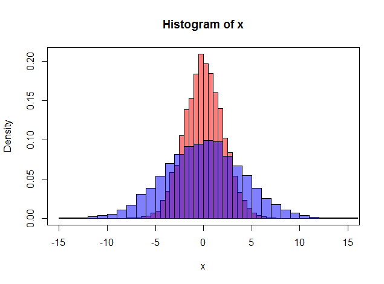

# STAT 3504 — Lecture 10, accessible Quarto conversion

Files:

```
lec10_twosample_tests.qmd    the deck
custom.scss                  theme (WCAG-checked colours, table and focus styles)
a11y-fixes.html              post-body script (decorative logo, deck landmark)
art/                         your existing figures — unchanged, not copied here
```

Render with:

```bash
quarto render lec10_twosample_tests.qmd
```

No R is needed: the deck is pure markdown, so the `markdown` engine is used and
rendering takes a second or two.

## One thing to check before you render: figure extensions

LaTeX resolves `\includegraphics{art/permut1}` to `.pdf`, `.png` or `.eps` on its
own. HTML cannot. Every stem is unchanged from the `.tex`, but `.png` has been
appended. Confirm what you actually have:

```bash
ls art/
```

If the files are already PNG or JPG, you are done (adjust the extension in the
`.qmd` if they are `.jpg`). If they are `.pdf` or `.eps`, browsers will not
display them — convert once:

```bash
# PDF -> PNG at 200 dpi
for f in art/*.pdf; do
  magick -density 200 "$f" -background white -alpha remove "${f%.pdf}.png"
done
```

SVG is the better target where the source is vector, since it stays sharp when a
low-vision student zooms to 400% (WCAG 1.4.4):

```bash
for f in art/*.pdf; do pdf2svg "$f" "${f%.pdf}.svg"; done
```

## Where the alt text lives

Quarto's attribute is `fig-alt`, the markdown equivalent of knitr's `fig.alt`
chunk option:

```markdown
{width="60%" fig-alt="Longer
description of what the figure shows."}
```

Caption and alt text do different jobs and deliberately differ. The caption gives
context to everyone; the alt text describes what a sighted student sees in the
plot — the shift, the spread, the separation of ranks — so a student using a
screen reader gets the same statistical point, not just the figure's title.

If you later regenerate these figures from R, move the alt text into the chunk:

```{r}
#| label: fig-scale
#| fig-alt: "Two overlaid histograms sharing a centre at 0 but differing in spread…"
#| echo: false
plot(...)
```

## What was changed, and why

Content is as in the Beamer source. The changes below are accessibility fixes
or unavoidable format differences.

**Accessibility**

1. **Alt text on all 10 figures** via `fig-alt` (WCAG 1.1.1).
2. **The repeated VT logo is marked decorative** (`alt=""`, `aria-hidden`) by
   `a11y-fixes.html`, so it is not announced on all 70 slides.
3. **Tables are real tables**, not images, with `<caption>`, `<th>` and
   `scope="col" | "colgroup" | "row"` (WCAG 1.3.1). This covers the three
   `tabular` environments: the new/traditional scores, the ranks table, and the
   20-row permutation table.
4. **Colours were darkened.** The Beamer palette ranged from 1.4:1 to 4.0:1
   against white; `\textcolor[rgb]{0,1,0.5}` (spring green) and `Goldenrod` were
   the worst offenders. `custom.scss` maps each to the nearest hue-preserving
   colour that clears 4.5:1, and lists the measured ratio beside each one.
   Nowhere does colour alone carry meaning (WCAG 1.4.1, 1.4.3).
5. **MathJax, not KaTeX**, because MathJax exposes MathML and speech text that
   VoiceOver, NVDA and JAWS can read equation-by-equation.
6. **Keyboard and motion**: visible focus rings, reveal.js menu and controls
   enabled with the keyboard tutorial, `prefers-reduced-motion` honoured
   (WCAG 2.1.1, 2.3.3, 2.4.7).
7. **`lang: en`** on the document (WCAG 3.1.1).
8. **`\beamergotobutton` jump links** became ordinary anchor links with
   descriptive text and a visible border, not colour alone.

**Format differences worth knowing about**

- **Titles were added to six frames that had none** in the source, so every
  slide has a heading for screen-reader and menu navigation. They are: *All 20
  permutations*, *Permutation distribution and p-value*, *Worked example: ranks
  in the combined sample*, *Null distribution of W*, *U for both samples*,
  *Back to Mann--Whitney*, and *Why relative efficiency?*. Delete the heading
  text and replace the `##` with a `---` if you would rather keep them blank.
- **`[allowframebreaks]` on "Choice of test statistics"** became two slides,
  which is what Beamer was doing at compile time anyway.
- **The `\onslide` reveal inside the `align` in the Proof slide** is now a
  single block. Reveal fragments cannot step through lines of one aligned
  environment without breaking the alignment. Every other `\item<n->`,
  `\pause` and `\onslide` became a `.fragment`, so the click-through pacing of
  the lecture is intact.
- **The commented-out `art/wheat` frame** was not carried over, matching the
  source.
- The `math-commands.tex` macros in use (`\NormRV`, `\iid`, `\E`, `\Var`,
  `\half`, `\abs`, `\dif`) are redefined in a hidden block at the top of the
  `.qmd`. Add any others you need there.

## Verifying the result

Quarto's output is plain HTML, so the usual tooling applies:

```bash
quarto render lec10_twosample_tests.qmd
npx pa11y-ci docs/lec10_twosample_tests.html     # or axe DevTools in the browser
```

Two caveats automated checkers will not catch:

- **`art/permut1.png` is a picture of a 20-row table.** Its alt text summarises
  the table rather than reproducing it, which is the best alt text can do. For a
  Title II audit this is the weakest point in the deck; the fix is to rebuild it
  as an HTML table the way the manual-calculation table already is.
- **Alt text quality is a judgement call.** The descriptions here were written
  from the LaTeX captions and the surrounding slide text. Please read them
  against the actual figures and correct anything that does not match — for
  instance, if `ARE_1` and `ARE_2` list different distributions than the
  standard normal / uniform / logistic / double-exponential / Cauchy set I
  assumed.
