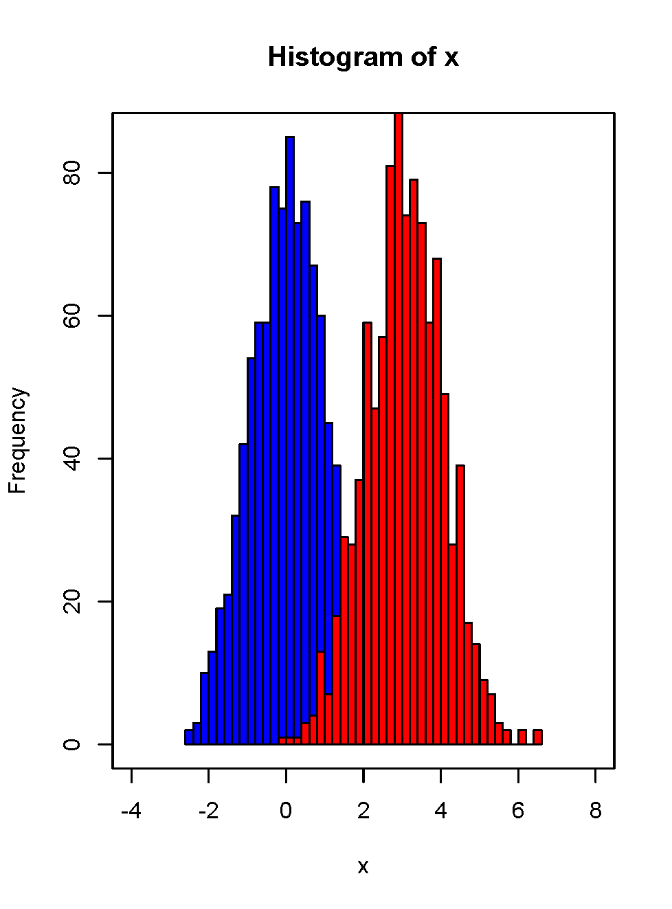
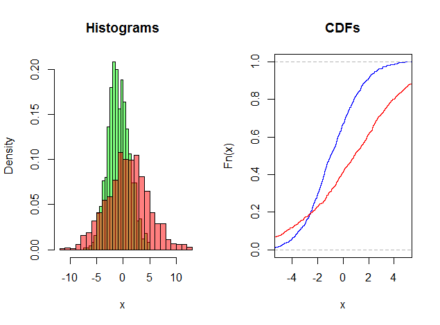
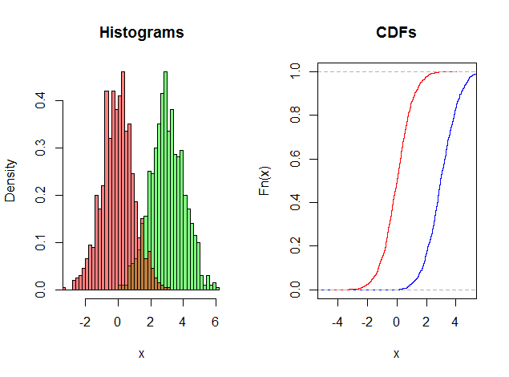
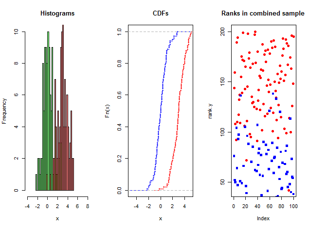
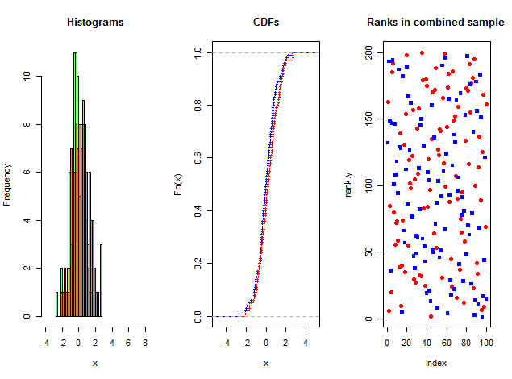

<!--
  ACCESSIBILITY NOTES (WCAG 2.1 AA / ADA Title II)
  ------------------------------------------------
  * Every image carries fig-alt. Decorative chrome (the repeated VT logo) is
    given alt="" + aria-hidden via a11y-fixes.html so AT does not announce it
    on all 70 slides.
  * All tabular data is real HTML/Markdown with <th> + scope, not pictures of
    tables, so screen readers can announce row/column headers.
  * Colour emphasis from the Beamer source is reproduced through the classes in
    custom.scss, every one of which clears 4.5:1 against white. Colour is never
    the only carrier of meaning.
  * MathJax (not KaTeX) is used because it exposes MathML + speech text to AT.
  * FIGURE PATHS: LaTeX resolves extensions automatically; HTML cannot. Stems
    are unchanged from the .tex; ".png" is assumed. If your art/ files are .pdf
    or .eps, convert them (see README-accessibility.md) or change the extension.
-->

::: {.hidden}
$$
\newcommand{\NormRV}{\mathcal{N}}
\newcommand{\iid}{\stackrel{\text{iid}}{\sim}}
\newcommand{\E}{\mathbb{E}}
\newcommand{\Var}{\operatorname{Var}}
\newcommand{\half}{\tfrac{1}{2}}
\newcommand{\quart}{\tfrac{1}{4}}
\newcommand{\abs}[1]{\left\lvert #1 \right\rvert}
\newcommand{\dif}{\mathrm{d}}
$$
:::

# Two-sample problem

## Outlines

- [T-Test]{.hl-orange}
- [Permutation Test]{.hl-orange}
- [Choice of Test statistics for Permutation Test]{.hl-orange}
- [Random sampling permutation]{.hl-rust}
- [Wilcoxon Rank Sum Test]{.hl-rust}
- [Using R to do all of these.]{.hl-magenta}

# Two-sample t-test

## Two-sample t-test

- Two samples from two populations (not necessarily of the same size!)
- Denote them by $X$ and $Y$.
- We have $m$ observations $X_1, \ldots, X_{m}$ in group 1 and $n$ observations $Y_1, \ldots, Y_{n}$ in group 2.
- Assume $X_1, \ldots, X_{m} \sim \NormRV(\mu_X, \sigma_X^2)$ and $Y_1, \ldots, Y_{n} \sim \NormRV(\mu_Y, \sigma_Y^2)$
- Could they have the same mean? That is: $\mu_X = \mu_Y$?
- The quantity of interest is $D_{obs}$, e.g. difference in means.
  $H_0: \mu_X - \mu_Y = 0$ vs. $H_a: \mu_X - \mu_Y \neq 0, \; > 0 \; <0$.

## One-sided vs. Two-sided

- In general, we can test if the difference is some pre-specified $\Delta_0$.
- Recall that we can have one-sided alternatives, either lower-tail or upper-tail or two-sided or two-tail alternative.
- Usually, the one-sided alternative is clear from the question or context: are you just trying to see if the two means are different or are you trying to see if one group (e.g. treatment) has a higher mean than the other (e.g. control)?
    - $H_0: \mu_X - \mu_Y \geq \Delta_0$ vs $H_a: \mu_X - \mu_Y < \Delta_0$ (lower-tail)
    - $H_0: \mu_X - \mu_Y \leq \Delta_0$ vs $H_a: \mu_X - \mu_Y > \Delta_0$ (upper-tail)
    - $H_0: \mu_X - \mu_Y = \Delta_0$ vs $H_a: \mu_X - \mu_Y \neq \Delta_0$ (two-tail)
- Also, remember that P-values for two-sided tests are twice the P-values for one-sided tests.

## Two-sample t-test  

- Estimator for the difference $\mu_X - \mu_Y$ = $\bar{X} - \bar{Y}$ = Difference of the sample means.
- We can calculate the variance of $\bar{X} - \bar{Y}$ using the same idea as we used for variance of a single sample mean, and assuming $X_i$'s and $Y_j$'s are independent.

$$
\Var(\bar{X} - \bar{Y}) = \Var(X)/m + \Var(Y)/n = \sigma_X^2/m + \sigma_Y^2/n.
$$

- Note: Independence is crucial: without it, the formula above will have an extra term.
- Now, similar to one sample, variance of $X_i$ can be estimated unbiasedly by $s_X^2$ and variance of $Y_j$'s are by $s_Y^2$. (Using $\approx$ to denote estimation.)

$$
s_X^2/m + s_Y^2/n \approx \sigma_X^2/m + \sigma_Y^2/n
$$

## Assumption of Equal Variance  

- Assume equal variances ($\sigma_X^2 = \sigma_Y^2 \equiv \sigma^2$). We can estimate the common variance by "pooling" the samples together:

$$
\begin{aligned}
s_p^2 & = \frac{\sum_{i=1}^{m} (X_i- \bar{X})^2 + \sum_{j=1}^{n}(Y_i - \bar{Y})^2}{m + n - 2} \\
& = \frac{(m-1)s_X^2 + (n-1)s_Y^2}{m + n - 2} = \text{ pooled estimator of variance}.
\end{aligned}
$$

- **Test Statistic:**

$$
t=\frac{(\bar{X}-\bar{Y})-\Delta_0}{s_p\sqrt{\frac{1}{m}+\frac{1}{n}}} \sim t_{m+n-2}
$$

- Here $s_p$ is the pooled standard deviation.

## Without Equal Variance  

- If we do not assume the equality of variances, then the form of the t-test statistics is simpler:

$$
t=\frac{(\bar{X}-\bar{Y})-\Delta_0}{\sqrt{s_X^2/m + s_Y^2/n}} \sim t_{k}
$$

- Unfortunately, this statistic does not have a t distribution.
- A t distribution replaces the $\NormRV(0, 1)$ distribution only when a single standard deviation $\sigma$ in a z-statistic is replaced by its sample standard deviation (s).
- In this case, we replace two standard deviations ($\sigma_x$ and $\sigma_y$) by their estimates which does not produce a statistic having a t distribution.
- However, we can approximate the distribution of the two-sample t statistic by using the $t(k)$ distribution with an approximation for the degrees of freedom $k$.

## Software approximation  

We noted earlier that the two-sample t statistic does not have an exact t distribution.
Moreover, the exact distribution changes as the unknown population standard deviations $\sigma_1$ and $\sigma_2$ change. However, the distribution can be approximated
by a t distribution with degrees of freedom given by

$$
df = \frac{(s_X^2/m + s_Y^2/n)^2}{\frac{1}{m-1} (s_x^2/m)^2 + \frac{1}{n-1} (s_Y^2/n)^2}
$$

Two options:

1. Use a value of $df$ that is calculated from the data. In general, it will not be a whole number.
2. Use $df$ equal to the smaller of $m-1$ and $n-1$.

We will see the first one in [R]{.smallcaps}, shortly.

## P-value and Inference

- The sampling distribution of the $t$-test statistics in the equal variance case follows a Student's $t$ distribution with $m+n-2$ degrees of freedom.
- We have also seen the approximation of the degrees of freedom for the unequal variance case.
- We can now calculate P-value for testing.
- We fix an $\alpha$ as significance level and if the P-value is less than $\alpha$, we reject the null hypothesis. If not, we say we do not have enough evidence to reject the null.

## R codes

- Translating this into [R]{.smallcaps} is straightforward.
- The standard [R]{.smallcaps} function for t-test is:

``` r
t.test(x, y = NULL,
       alternative = c("two.sided", "less", "greater"),
       mu = 0, paired = FALSE, var.equal = FALSE,
       conf.level = 0.95, ...)
```


# Permutation test

## Steps for a two-sample permutation test  

- Suppose we have $m$ observations $X_1, \ldots, X_m$ in group 1 and $n$ observations $Y_1, \ldots, Y_n$ in group 2. The quantity of interest is $D_{obs}$, e.g. difference in means.
  $H_0: \mu_X - \mu_Y = 0$ vs. $H_L: \mu_X - \mu_Y \neq 0, \; > 0 \; <0$.
- Permute the $m+n$ observations so that $m$ are in group 1 and $n$ are in group 2. R command is `combn`.
- Calculate the statistics of interest $D$ for all possible permutations: $\binom{m+n}{m} = (m+n)!/m!n!$.
- Calculate the p-values accordingly:

$$
p =
\begin{cases}
\frac{\# |D| \geq |D_{obs}|}{\binom{m+n}{m}} & \mbox{two-sided} \\[2ex]
\frac{\# D \geq D_{obs}}{\binom{m+n}{m}} & \mbox{upper-tailed, one-sided} \\[2ex]
\frac{\# D \leq D_{obs}}{\binom{m+n}{m}} & \mbox{lower-tailed, one-sided}
\end{cases}
$$

## Recap with last example  

- Suppose you have data on two testing methods: new and old. The raw data is as follows:

```{=html}
<table class="data-table">
  <caption>Scores for the new and traditional testing methods, with group means and medians.</caption>
  <thead>
    <tr>
      <th scope="col">Method</th>
      <th scope="colgroup" colspan="3">Score</th>
      <th scope="col">Mean</th>
      <th scope="col">Median</th>
    </tr>
  </thead>
  <tbody>
    <tr><th scope="row">New X</th><td>37</td><td>55</td><td>57</td><td>49.7</td><td>55</td></tr>
    <tr><th scope="row">Traditional Y</th><td>23</td><td>31</td><td>70</td><td>41.3</td><td>31</td></tr>
  </tbody>
</table>
```

- Difference in medians: $median(X) - median(Y) = 21$, Difference in means: $\bar{X} - \bar{Y} = 8.3$.
- Question: Is the difference significant?
- Parametric test: $t$-test with $\bar{X} - \bar{Y}$. Sample size too low to know if normality assumptions are appropriate.
- Can we test the difference without any distributional assumption?

## Permutation Test

- Let $\Delta = \mu_X - \mu_Y$, $\mu_X,\mu_Y$ could be any measure of central tendency (mean, median, mode).
- Test $H_0: \Delta = 0$ vs. $H_L: \Delta \neq 0$ or $\Delta > 0$ etc.
- **Intuition:** If there is no difference between the two samples, we can partition the $(m+n)$ observations in any way between the two groups and the statistics of interest (e.g. mean difference) should be similar to the one observed. In other words, all possible shufflings are equally likely, and under the null hypothesis of no difference the group labels do not matter.
- For this example: $\binom{6}{3} = 20$. We can manually list all $20$ permutations!!

## All 20 permutations {#permutation-table}

{width="80%" fig-alt="Screenshot of a 20-row table. Each row is one of the 20 ways of splitting the six scores 37, 55, 57, 23, 31 and 70 into a group of three X values and a group of three Y values. Two right-hand columns give, for each split, the resulting difference in means (Delta 1 j star) and difference in medians (Delta 2 j star). The observed split sits in the first row with a mean difference of 8.3 and a median difference of 21; seven of the twenty mean differences are at least as large as 8.3 and four of the twenty median differences are at least as large as 21."}

## Permutation distribution and p-value  

- The column $\Delta_{1j}^*$ and $\Delta_{2j}^*$ give the permutation distribution of $\Delta_1$ = difference in means, and $\Delta_2$ = difference in medians respectively. 

- The permutation distribution is an appropriate reference distribution for determining the p-value for the test.

- Recall p-value is the probability that the test statistic is more extreme than the observed one under the null hypothesis.

$$
\mbox{p-value} = \frac{\# D \geq D_{obs}}{\binom{m+n}{m}} \quad \mbox{one-sided}
$$

- This example: p-value: 7/20 = 0.35 (mean) and p-value = 4/20 = 0.2 (median).


## Choice of test statistics  

The permutation test can be done with a few different test-statistics:

1. Usual difference in means: $\Delta_1 = \bar{X} - \bar{Y}$.
2. The sum of observations from either group: Let $S_X$, $S_Y$ be sum of observations from Group 1 and Group 2, and $S = S_X + S_Y$, respectively. Then:

$$
\bar{X} - \bar{Y} = \frac{S_X}{m} - \frac{S_Y}{n} = \frac{S_X}{m} - \frac{S - S_X}{n} = S_X\left( \frac{1}{m} + \frac{1}{n} \right) - \frac{S}{n}.
$$

   Using sum of observations in either group will lead to the same result as using mean difference as $S$ is same for all permutations.

3. We don't use the t-test, but we can steal the test-statistics: standardized difference in means.
4. Difference in median: Robust to outliers.
5. Difference of trimmed means: can reduce the influence of extreme observations; requires symmetry of the distribution. E.g. 10% trimmed mean is the mean of all observations after deleting the top 5% largest and the bottom 5% smallest values.

## Choice of test statistics (contd.)

**Some Recommendations.**

1. If data are symmetric without outliers: Use difference in means.
2. Symmetric but have outliers: use difference in trimmed means
3. Asymmetric: use difference in medians.
4. **Safest option:** When in doubt, use median.

## Random sampling permutation  

- As $m$ and $n$ increase, the number of permutations could be too large. For example, $\binom{16}{8}= 12870, \binom{20}{10}=1{,}84{,}756$.
- It is not feasible to exhaust all of those permutations.

**An approximate permutation p-value:**

1. take a random sample of say, $R = 1000$ permutations.
2. calculate the statistic of interest $D$ for each permutation sample.
3. approximate the p-value using the reference distribution formed by the $R$ permutation statistics in the same manner as the exact permutation test The approximation improves as R increases.
4. The standard error for approximate p-value: $\sqrt{\{p(1-p)\}/R}$ where $p$ is the exact p-value.
5. If true $p = 0.05$ and you take $R = 1000$ samples, margin of error is $\sqrt{0.5\times 0.95 / 1000} = 0.00689202437$.

## Permutation Test: Pouring Times

We use the pouring-times data: testing whether before-lunch times tend to be **shorter** than after-lunch times.

$$H_0: F_{\text{before}} = F_{\text{after}} \qquad H_1: \mu_{\text{before}} < \mu_{\text{after}}$$

```{r perm-setup}
#| echo: true

x <- c(12.6, 11.2, 11.4,  9.4, 13.2, 12.0)   # before lunch
y <- c(16.4, 15.4, 14.1, 14.0, 13.4, 11.3)   # after lunch
```


## R code for permutation test

```{r perm-test}
#| echo: true

set.seed(12345)
B        <- 500
combined <- c(x, y)
m        <- length(x)
n        <- length(y)
N        <- m + n

# Observed test statistic
T_obs <- mean(x) - mean(y)
T_obs
## [1] -3.316667

# Monte Carlo permutation distribution
T_perm <- replicate(B, {
  perm <- sample(combined)
  mean(perm[1:m]) - mean(perm[(m+1):N])
})

# One-sided p-value: P(T <= T_obs) since H_1: mu_before < mu_after
(p_perm <- mean(T_perm <= T_obs))
```

- The p-value is `r p_perm` and we can reject the null hypothesis since this is less than $\alpha = 0.05$.

## We can compare with the t-test! 

```{r}
t.test(x, y, "less")
```

The permutation test leads to the same conclusion as the t-test. 

## Visualization

```{r perm-plot}
hist(T_perm, breaks = 40,
     main = "Permutation Null Distribution",
     xlab = expression(bar(X) - bar(Y)),
     col = "steelblue", border = "white")
abline(v = T_obs, col = "red", lwd = 2, lty = 2)
legend("topleft",
       legend = paste0("T_obs = ", round(T_obs, 3),
                       "\np = ",   round(p_perm, 4)),
       bty = "n", text.col = "red")
```

## Exact Permutation

For $m = n = 6$ there are $\binom{12}{6} = 924$ permutations: small enough to enumerate **exactly**:

```{r perm-exact}
#| echo: true

# All ways to choose m positions out of N for group X
all_combs <- combn(N, m)   # each column is one assignment

T_exact <- apply(all_combs, 2, function(idx) {
  mean(combined[idx]) - mean(combined[-idx])
})

# Exact one-sided p-value
(p_perm_exact <- mean(T_exact <= T_obs))
```

The p-value for the permutation test if we use all possible permutations is `r p_perm_exact`. 

The p-value for $B = 500$ permutations was `r p_perm`, not too far off!

# Wilcoxon rank-sum test

## Recap: Two-sample Problem

- Sign-test and Signed-rank test: applicable to both one-sample as well as paired-sample problems.
- Paired-sample: Also called Matched-pair problem. Two dependent samples, where pairing makes sense, or a single sample from a bivariate population. Examples: Before and After a 'treatment'.
- First step for paired-sample problems is to take the difference between the matched pairs $\Rightarrow$ reduces to a one-sample problem.

## Paired samples vs. Indep. samples

- General two-sample problem: Two 'mutually independent' random samples, possibly of different sizes.
- In practice: you will just observe the experiment and the data -- whether the samples are mutually independent or paired will depend on the experiment.

::: {.fragment}
- Technically, all the two-sample methods can be applied to any matched-pair data -- but ignoring the 'pairing' information means loss of power.
:::

## Different modeling assumptions  

- The performance of the test depends on the **modeling assumptions** and how close they are to the reality.
- If normality assumption is valid, $t$-test is the most powerful test.
- In reality, we make a varying degree of assumptions.
    1. Location/shift model.
    2. Scale model.
    3. Location-scale model.
- We can also operate with just the assumption of **IID-ness**, **Continuity**.
- Tests that make relatively fewer assumptions are more robust against **model misspecification**, they will reject if there is any departure at all.
- The very generality of these tests weakens them against specific alternatives.

::: {.fragment}
- 'Very general' tests: Wald-Wolfowitz runs test, [Kolmogorov-Smirnov]{.hl-green} two-sample test.
:::

## Location model  

- One common assumption is *location model* or *shift model*. $X$ and $Y$ populations are exactly the same except for an unknown shift $\delta$, i.e., $X$ is distributed as $Y-\delta$.

$$
F_Y(a) = P(Y \le a) = P(X \le a - \delta) = F_X(a - \delta), \mbox{for all } a \mbox{ and } \delta \neq 0
$$

- Permutation Test and Wilcoxon rank-sum test. $H_0: \delta = 0$ vs. $H_1: \delta > 0 / <0 / \neq 0$.

{width="30%" fig-alt="Two overlaid histograms of random samples on a common horizontal axis. The first sample, from a standard normal distribution, is centred at 0; the second, from a normal distribution with mean 3 and the same unit standard deviation, has an identically shaped bell but is shifted three units to the right. The two curves have the same spread and overlap only in their tails, illustrating a pure location shift."}

## Scale model  

- Another assumption about the underlying model is called the scale model, which assumes [the $X$ and $Y$ populations are the same except for a scale factor $\sigma$]{.hl-navy}

$$
F_Y(a) = P(Y \le a) = P(X \le a \times \sigma) = F_X( a \sigma)
$$

- This means $X/\sigma$ and $Y$ has the same distribution, or $X$ and $Y \sigma$ have the same distribution.

{width="60%" fig-alt="Two overlaid histograms of random samples sharing the same centre at 0 but differing in spread. The first sample, with standard deviation 2, is tall and narrow; the second, with standard deviation 4, is lower and much wider, with observations reaching roughly twice as far into both tails. The centres coincide, so the difference is purely one of scale."}

## Location-scale model  

- Now, can you tell me what is a location-scale model?

::: {.fragment}
- Easiest to write in three parameters: location for $X$ = $\mu_X$, location for $Y$ = $\mu_Y$, and scale = $\sigma$.
- $(X - \mu_X)/\sigma$ and $Y-\mu_Y$ are identically distributed.
- Location-scale model: $X$ and $Y$ have same distribution, except for a location and scale shift.
:::

{width="60%" fig-alt="Two overlaid histograms of random samples that differ in both centre and spread. The first, with mean minus 1 and standard deviation 2, is narrower and sits to the left; the second, with mean 1 and standard deviation 4, is wider, flatter and shifted to the right. The two differences — in location and in scale — are present at the same time."}

## Alternatives and General Strategy  

:::: {.columns}

::: {.column width="50%"}
- The null hypothesis is almost always that the two population distributions are identical and it is completely unspecified.
- The most general alternatives are:
    1. Two sided: $H_A: F_Y(x) \neq F_X(x)$ for some $x$.
    2. One sided: $H_A: F_Y(x) \geq F_X(x)$ for all $x$, and $F_Y(x) > F_X(x)$ for some $x$. ($X$ is **stochastically larger** than $Y$, denoted as $X \stackrel{st}{>} Y$).
    3. The wikipedia page: [stochastic ordering](https://en.wikipedia.org/wiki/Stochastic_ordering).
:::

::: {.column width="50%"}
{width="100%" fig-alt="A two-panel figure. The top panel shows two histograms, one centred at 0 and one centred at 3, with little overlap. The bottom panel shows the two corresponding empirical cumulative distribution functions: the curve for the sample centred at 0 rises first and lies entirely above and to the left of the curve for the sample centred at 3, which never crosses it. This non-crossing of the two CDFs is what it means for one sample to be stochastically larger than the other."}
:::

::::

## Strategy

- Under the null, the two random samples $X_1, \ldots, X_m$ and $Y_1, \ldots, Y_n$ can be considered as a single random sample of size $N = (m+n)$ drawn from the common continuous but unspecified population.
- Then the observed order configuration of $X$ and $Y$ sample is one of the $\binom{m+n}{m}$ possible equally likely arrangements.
- If null is not true: $X$ and $Y$ will not be randomly mixed -- there will be a pattern how the original $X$'s and $Y$'s are ordered in the combined sample.
- Two-sample NP tests try to come up with a function that can detect this departure.

## Location-shift model

Jump to: [Wilcoxon Rank-sum test](#wilcox){.jump-button}

{width="88%" fig-alt="A multi-panel figure comparing a sample from a normal distribution with mean 3 against one from a standard normal. The histogram panel shows two well-separated bells; the CDF panel shows two non-crossing step functions; the ranks panel plots the position of each observation in the pooled, sorted sample, where the observations from the mean-3 sample occupy almost all of the high ranks and the standard normal observations almost all of the low ranks. The clean separation of ranks is the signal a rank-sum test detects."}

## Location-shift model {#alt}

What happens if I take two distributions to be $\NormRV(0,1)$ and $\NormRV(\half,1)$??

::: {.fragment}
{width="85%" fig-alt="The same three-panel layout as the previous figure, but for two normal samples whose means differ by only one half. The histograms overlap heavily, the two empirical CDFs run close together and nearly touch along their length, and in the ranks panel the observations from the two samples are thoroughly interleaved rather than separated. One distribution is still stochastically larger, but the visual evidence is weak."}
:::

Stochastically larger, but difference might NOT be 'statistically' significant.

## Wilcoxon Rank-Sum Statistics {#wilcox .smaller}

- For distribution with heavy tails, there may be extremely large/small values, and thus make t-test invalid or lack of power.
- Instead of comparing the sample mean of the observations from two groups, we compare the **ranks**.
- Let $\Delta = \mu_X - \mu_Y$ and we want to test $H_0: \Delta = 0$. (No Location Shift).
- Combine $X_1, \ldots, X_m$ and $Y_1, \ldots, Y_n$ into a combined sample of $m+n$ observations.
- Let $R_i$ be the rank of $X_i$ for $i = 1, \ldots,m$ and $S_j$ be the rank of $Y_j$ for $j = 1, \ldots, n$ **in the combined sample**. (Like Wilcoxon's other test, use mid-rank for ties).
- **Idea:** If $\Delta > 0$, i.e. $\mu_X > \mu_Y$, $R_i$'s would take higher values than $S_j$'s in the combined sample.

## Worked example: ranks in the combined sample  

Old example: Two testing methods: old and new. We want to know if the mean difference is $0$ or higher than $0$.

```{=html}
<table class="data-table">
  <caption>Scores and their ranks in the combined sample of six observations, with group means and rank sums.</caption>
  <thead>
    <tr>
      <th scope="col"></th>
      <th scope="col">Obs. 1</th>
      <th scope="col">Obs. 2</th>
      <th scope="col">Obs. 3</th>
      <th scope="col">Mean</th>
      <th scope="col">Rank sum</th>
    </tr>
  </thead>
  <tbody>
    <tr><th scope="row">New X</th><td>37</td><td>55</td><td>57</td><td>49.7</td><td></td></tr>
    <tr><th scope="row">Rank R</th><td>3</td><td>4</td><td>5</td><td></td><td>12</td></tr>
    <tr><th scope="row">Traditional Y</th><td>23</td><td>31</td><td>70</td><td>41.3</td><td></td></tr>
    <tr><th scope="row">Rank S</th><td>1</td><td>2</td><td>6</td><td></td><td>9</td></tr>
  </tbody>
</table>
```

- The Wilcoxon rank sum test uses the same approach as permutation test, where the statistic of interest is:
  $W$ = sum of ranks from group 1 (or 2):

$$
W_X = \sum_{i=1}^{m} R_i, \quad W_Y = \sum_{j=1}^{n} S_j
$$

- Note that $W_X + W_Y = 1 + 2 + \ldots + N = \frac{N(N+1)}{2}$, where $N = m+n$ is the size of the combined sample.

## Repeat: Permutation Test with Wilcoxon Rank Sum Statistics  

- Let $\Delta = \mu_X - \mu_Y$, $\mu_X,\mu_Y$ could be any measure of central tendency (mean, median, mode).
- Test $H_0: \Delta = 0$ vs. $H_L: \Delta \neq 0$ or $\Delta > 0$ etc.
- **Intuition:** If there is no difference between the two samples, we can partition the $(m+n)$ observations in any way between the two groups and the statistics of interest (here $W_X$ or $W_Y$) should be similar to the one observed.
- In other words, all possible shufflings are equally likely, and under the null hypothesis of no difference the group labels do not matter.
- For this example: $\binom{6}{3} = 20$. We can manually list all $20$ permutations!!

## How to reject  

- Remember: $\Delta = \mu_X - \mu_Y$ and we want to test $H_0: \Delta = 0$.
- The alternative will either be specified, or, it will be clear from the context of the story.
- In other words, when you apply `alternative="less"` or `alternative = "greater"`, be careful you are using the correct direction.
- Correct test with wrong direction will give you the exact opposite conclusion.

::: {.fragment}
1. $H_A : \Delta > 0$: $X$ is shifted to the right. Reject $H_0$ when $W_x$ is large, or equivalently when $W_y$ is small.
2. $H_A : \Delta < 0$: $X$ is shifted to the left. Reject $H_0$ when $W_x$ is small, or equivalently when $W_y$ is large.
3. $H_A : \Delta \neq 0$. Reject $H_0$ when $W_x$ is either too small or too large.
:::

## Why Rank-sum tests?

- Benefit of conducting test based on ranks: *the test will not be affected by extreme values (ranks but not magnitudes matter)*
- Under $H_0$, $E(W)$ and $V(W)$ are only functions of $m$ and $n$, so the critical values of $W$ for upper-tailed and lower-tailed tests can be tabulated.

::: {.fragment}
- It will be a very long table. **Gibbons and Chakraborti: Table J: pp. 574 - 582**! You want every possible combination of $m$ and $n$ until a moderate value of $n$ or $m$.
- However, for small $m$ and $n$ it's easy to do manually, and for large $m,n$ we have [R]{.smallcaps} as well as normal approximations using CLT.
:::

## How to test? {background-color="#dceefc"}

::: {.center-heading}
We will see the Permutation test approach now, and learn CLT after we learn an exactly equivalent two-sample test called Mann--Whitney U test.
:::

## Null distribution of $W$  

- The null distribution of $W$ is needed to obtain the critical values and the p-value.
- Under $H_0$, as in the permutation test, the $\binom{m+n}{n}$ partitions have the equal chance to occur, each yielding one value of $W$.
- So we can obtain the null distribution of $W$ by looking at all permutations when $m$ and $n$ are small.
- I will repeat myself: I can get away with this because the sample size is small, these calculations will be tedious and not feasible for larger sample sizes.
- Refer to the in-class example: **Calculation of p-value (hand-out)**
- The observed test statistic value $W_{obs} = 12$ (sum of ranks for group $X$).

## Manual calculation {.scrollable}

```{=html}
<table class="data-table compact">
  <caption>All 20 permutations of the six ranks into an X group and a Y group, with the resulting rank sum for the X group and an indicator of whether it is at least the observed value of 12.</caption>
  <thead>
    <tr>
      <th scope="col">k</th>
      <th scope="colgroup" colspan="3">Ranks permuted <span class="math inline">\(X_i\)</span></th>
      <th scope="colgroup" colspan="3">Ranks permuted <span class="math inline">\(Y_i\)</span>'s</th>
      <th scope="col">Rank sum <span class="math inline">\(W_k^*\)</span></th>
      <th scope="col"><span class="math inline">\(I\{W_k^* \geq 12\}\)</span></th>
    </tr>
  </thead>
  <tbody>
    <tr><th scope="row">1</th><td>3</td><td>4</td><td>5</td><td>1</td><td>2</td><td>6</td><td>12</td><td>1</td></tr>
    <tr><th scope="row">2</th><td>3</td><td>4</td><td>1</td><td>5</td><td>2</td><td>6</td><td>8</td><td>0</td></tr>
    <tr><th scope="row">3</th><td>3</td><td>4</td><td>2</td><td>5</td><td>1</td><td>6</td><td>9</td><td>0</td></tr>
    <tr><th scope="row">4</th><td>3</td><td>4</td><td>6</td><td>5</td><td>1</td><td>2</td><td>13</td><td>1</td></tr>
    <tr><th scope="row">5</th><td>3</td><td>5</td><td>1</td><td>4</td><td>2</td><td>6</td><td>9</td><td>0</td></tr>
    <tr><th scope="row">6</th><td>3</td><td>5</td><td>2</td><td>4</td><td>1</td><td>6</td><td>10</td><td>0</td></tr>
    <tr><th scope="row">7</th><td>3</td><td>5</td><td>6</td><td>4</td><td>1</td><td>2</td><td>14</td><td>1</td></tr>
    <tr><th scope="row">8</th><td>3</td><td>1</td><td>2</td><td>4</td><td>5</td><td>6</td><td>6</td><td>0</td></tr>
    <tr><th scope="row">9</th><td>3</td><td>1</td><td>6</td><td>4</td><td>5</td><td>2</td><td>10</td><td>0</td></tr>
    <tr><th scope="row">10</th><td>3</td><td>2</td><td>6</td><td>4</td><td>5</td><td>1</td><td>11</td><td>0</td></tr>
    <tr><th scope="row">11</th><td>4</td><td>5</td><td>1</td><td>3</td><td>2</td><td>6</td><td>10</td><td>0</td></tr>
    <tr><th scope="row">12</th><td>4</td><td>5</td><td>2</td><td>3</td><td>1</td><td>6</td><td>11</td><td>0</td></tr>
    <tr><th scope="row">13</th><td>4</td><td>5</td><td>6</td><td>3</td><td>1</td><td>2</td><td>15</td><td>1</td></tr>
    <tr><th scope="row">14</th><td>4</td><td>1</td><td>2</td><td>3</td><td>5</td><td>6</td><td>7</td><td>0</td></tr>
    <tr><th scope="row">15</th><td>4</td><td>1</td><td>6</td><td>3</td><td>5</td><td>2</td><td>11</td><td>0</td></tr>
    <tr><th scope="row">16</th><td>4</td><td>2</td><td>6</td><td>3</td><td>5</td><td>1</td><td>12</td><td>1</td></tr>
    <tr><th scope="row">17</th><td>5</td><td>1</td><td>2</td><td>3</td><td>4</td><td>6</td><td>8</td><td>0</td></tr>
    <tr><th scope="row">18</th><td>5</td><td>1</td><td>6</td><td>3</td><td>4</td><td>2</td><td>12</td><td>1</td></tr>
    <tr><th scope="row">19</th><td>5</td><td>2</td><td>6</td><td>3</td><td>4</td><td>1</td><td>13</td><td>1</td></tr>
    <tr><th scope="row">20</th><td>1</td><td>2</td><td>6</td><td>3</td><td>4</td><td>5</td><td>9</td><td>0</td></tr>
  </tbody>
</table>
```

## Manual calculation  

- Among $20$ permutations, total $7$ of $W_k^*$ are greater than $W_{obs} = 12$.
- Therefore, the exact p-value for the **upper-tailed** test is $p = \frac{7}{20} = 0.35$.
- The p-value for two-tailed test is twice that of the one-sided p-value, i.e. $p = 2\times 0.35 = 0.7$.
- Since $\#\{ W_k^* \leq 12 \}= 16$, the exact p-value for the **lower-tailed** test is $16/20 = 0.8$.
- In general, for
    - upper-tailed test: p-value = $\#\{ W_k^* \geq W_{obs}\} / \binom{m+n}{m}$.
    - lower-tailed test: p-value = $\#\{ W_k^* \leq W_{obs}\} / \binom{m+n}{m}$
    - two-tailed test: double of the p-value for the one-tailed test.

[Back to: Location-shift model](#alt){.jump-button}

# Mann-Whitney U Test

## Mann-Whitney U Test  

- Two-sample tests for location are based on the idea that the particular pattern exhibited by the combined ordered arrangement of the $X$ and $Y$ random variables provide information about their relationship.
- Wald--Wolfowitz runs test*: Measures the tendency to cluster by total number of runs of $X$'s and $Y$'s.
- Wald--Wolfowitz runs test rejects the null hypothesis $F_X = F_Y$ if there's too few runs.

::: {.fragment}
- We will not cover this in class since K-S test is more powerful and easy to understand/apply.
- Mann--Whitney test: position of $Y$'s and $X$'s in the combined and sorted sample. If most of the $Y$'s are greater than most of the $X$'s (or vice versa), there is evidence against the null.
:::

## Mann--Whitney $U$ Test  

- The [Mann--Whitney]{.hl-gold} U test statistics is defined as the number of times a $Y$ precedes an $X$ in the combined ordered arrangement of the two independent random samples into a single sample.

::: {.fragment}
- Define $m \times n$ indicator random variables as:

$$
D_{ij} = \begin{cases}
1 & \mbox{ if } Y_j < X_i \\
0 & \mbox{ if } Y_j > X_i \quad \mbox{for } i = 1,2, \ldots,m, \; j = 1,2,\ldots,n.
\end{cases}
$$

- Mann--Whitney U statistic can be written in symbols as:

$$
U = \sum_{i=1}^{m}\sum_{j=1}^{n} D_{ij}
$$
:::

::: {.fragment}
- $U$ = \# of pairs $(X_i, Y_j)$ for which $X_i > Y_j$.
:::

::: {.fragment}
- We reject the null [$H_0: F_X = F_Y$]{.hl-indigo} if $U$ is either too large or too small, depending on the alternative.
:::

## Mann--Whitney $U$ Test  

- Direct method: For each observation in one set (either $X$ or $Y$), count the number of times this first value wins over any observations in the other set (the other value loses if this first is larger). Count 0.5 for any ties.

::: {.fragment}
- Suppose $m = 3$, $n = 4$ and all $X$'s are smaller than all $Y$'s. Sorted sample would look like:
  $(\textcolor{#4C4C9E}{X_1, X_2, X_3}, Y_1, Y_2, Y_3, Y_4)$: U-statistic for $X$ ?
:::

::: {.fragment}
- $U_X$ = \# times $X_1$ wins + \# times $X_2$ wins + \# times $X_3$ wins = 0 + 0 + 0 = 0.
:::

::: {.fragment}
- $U_X$ is small if $X$'s are smaller than $Y$'s.
:::

## Mann--Whitney $U$ Test  

- Again, $m = 3$, $n = 4$ and all $X$'s are larger than all $Y$'s. Sorted sample would look like:
  $(Y_1, Y_2, Y_3, Y_4, \textcolor{#4C4C9E}{X_1, X_2, X_3})$: U-statistic for $X$?

::: {.fragment}
- $U_X$ = \# times $X_1$ wins + \# times $X_2$ wins + \# times $X_3$ wins = 4 + 4 + 4 = 12.
:::

::: {.fragment}
- $U_X$ is large if $X$'s are larger than $Y$'s.
:::

## Mann--Whitney $U$ Test  

- Now, suppose $X$'s and $Y$'s are mixed:
  $(\textcolor{#4C4C9E}{X_1, X_2}, Y_1, Y_2, Y_3, Y_4, \textcolor{#4C4C9E}{X_3})$: U-statistic for $X$? $U_X = 0 + 0 + 4 = 4$.

::: {.fragment}
- $U_X$ = \# times $X_1$ wins + \# times $X_2$ wins + \# times $X_3$ wins = 0 + 0 + 4 = 4.
:::

::: {.fragment}
- If $X$ and $Y$ samples are well mixed, $U_X$ should neither be too large or too small.
:::

::: {.fragment}
- Now, how about the U-statistics for $Y$-sample?
:::

## $U$ for both samples  

- Direct method: For each observation in one set (either $X$ or $Y$), count the number of times this first value wins over any observations in the other set (the other value loses if this first is larger). Count 0.5 for any ties.

::: {.fragment}
- Suppose $m = 3$, $n = 4$ and all $X$'s are smaller than all $Y$'s. Sorted sample :
  $(\textcolor{#4C4C9E}{X_1, X_2, X_3}, Y_1, Y_2, Y_3, Y_4)$: U-statistic for $X$ = 0. U-statistic for $Y$ = 3 + 3 + 3 + 3 = 12.
:::

::: {.fragment}
- Again, $m = 3$, $n = 4$ and all $X$'s are larger than all $Y$'s. Sorted sample :
  $(Y_1, Y_2, Y_3, Y_4, \textcolor{#4C4C9E}{X_1, X_2, X_3})$: U-statistic for $X$ = 4 + 4 + 4 = 12. U-statistic for $Y$ = ?
:::

::: {.fragment}
- Now, suppose $X$'s and $Y$'s are mixed:
  $(\textcolor{#4C4C9E}{X_1, X_2}, Y_1, Y_2, Y_3, Y_4, \textcolor{#4C4C9E}{X_3})$: U-statistic for $X$? $U_X = 0 + 0 + 4 = 4$. U-statistic for $Y$ = 2 + 2 + 2 + 2 = 8. (Each $Y_i$ wins twice!).
:::

::: {.fragment}
- We don't need separate calculation: $U_Y = \mbox{\# of all possible pairs} - U_X = mn - U_X = 12 - 4 = 8$.
:::

## Theory behind Mann--Whitney $U$ Test  

- Statisticians worry about **consistency** (*outcome of the procedure with unlimited data should identify the underlying truth.*)
- For Mann-Whitney test, the underlying truth is not the two medians or distributions but the true probability that $Y$ is less than $X$, or, $p = P(Y < X)$.
- If the two samples come from the same distribution, which is our null hypothesis, then $p = 1/2$.

::: {.callout-important icon=false title="Consistency"}
Let $U$ be the Mann--Whitney $U$ statistics for testing location shift between two independent samples $X$ and $Y$ of size $m$ and $n$ respectively, then as $m,n \to \infty$:

$$
\frac{U}{mn} \to p, \quad \text{and under} \; H_0, \frac{U}{mn}\to \half
$$
:::

## Proof  

$$
\begin{aligned}
p = P(Y < X) & = \int_{-\infty}^{\infty} P(Y \leq x) f_X(x)\, dx\\
& = \int_{-\infty}^{\infty} F_Y(x) f_X(x)\, dx\\
& = \int_{-\infty}^{\infty} \textcolor{#C00000}{F_Y(x)}\,\textcolor{#0B4F9C}{d F_X(x)} && \mbox{$\dif F_x(x)/ \dif x = f_X(x)$}\\
& = \int_{-\infty}^{\infty} \textcolor{#C00000}{F_X(x)}\,\textcolor{#0B4F9C}{d F_X(x)} && \mbox{(Because, under the null $F_Y = F_X$)}\\
& = \int_{0}^{1} \textcolor{#C00000}{u}\,\textcolor{#0B4F9C}{du} && \mbox{Change of variable $F_x(x) = u$}\\
& = \int_{0}^{1} \textcolor{#C00000}{u}\,\textcolor{#0B4F9C}{du} = 0.5.
\end{aligned}
$$

Hence, $p = P(Y < X) = 1/2$ when the null hypothesis is true $F_X = F_Y$.

## Theory behind Mann-Whitney's U  

- What did I just do? I've shown under the null hypothesis, $P(Y < X) = 1/2$.
- Now, definition of $U$-statistic is \# of pairs $(X_i, Y_j)$ for which $X_i > Y_j$, i.e.

$$
U_X = \sum_{i=1}^{m} \sum_{j=1}^{n} \underbrace{I\{X_i > Y_j\}}_{probability = p} \; \Rightarrow \; E(U_X) = mnp
$$

- Under $H_0$, $p = \half$, i.e. $E(U_X) = E(U_Y) = mn/2$. Each sample should win about half of the pairwise competitions.
- Derivation of the variance formula is more involved: I'll just leave the expression here:

$$
Var(U_X \mid H_0) = Var(U_Y \mid H_0)= \frac{m n (m+n+1)}{12} \quad \mbox{Need it for CLT}.
$$

## Mann-Whitney $\equiv$ Wilcoxon rank-sum  

- Mann-Whitney test is equivalent to Wilcoxon rank-sum test, which is why we people sometimes club them together and call the procedure a Mann-Whiteny-Wilcoxon test.
- If you know one, you know the other.
- [In [R]{.smallcaps}, the function is called `wilcox.test(x,y,paired=FALSE)` and it returns the $U$ statistics!]{.hl-navy}
- **Wilcoxon rank-sum and Mann--Whitney U are equivalent.**

$$
\begin{aligned}
U_x & = W_x - \sum_{i=1}^{m} i = W_x - m(m+1)/2 , \; \text{and} \\
U_y & = W_y - \sum_{i=1}^{n} i = W_y - n(n+1)/2.
\end{aligned}
$$

## Mann-Whitney & Wilcoxon rank sum.  

- The $U$ statistic is a function in the rank sum:
- $U_x = W_x - \sum_{i=1}^{m} i = W_x - m(m+1)/2$ and equivalently: $U_y = W_y - \sum_{i=1}^{n} i = W_y - n(n+1)/2$

::: {.fragment}
- We only need to calculate one of these statistics, $U_x$ or $U_y$, since $U_x + U_y = mn$.
- [In R, `wilcox.test(x,y,paired=F)` returns the $U$ statistics.]{.boxed}
:::

::: {.fragment}
- Consider two toy examples:
- $x = (1,2,3), y = (4,5,6)$, What is $W_x$? What is $U$?
:::

::: {.fragment}
- $x = (1,2,3), y = (4,5,6)$, $W_x = 1+2+3 =6$. $U = 0$.
- In R: `wilcox.test(c(1,2,3),c(4,5,6),paired=F)` returns W = 0, p-value = 0.1 (U statistics!)
:::

::: {.fragment}
- Switch $x$ and $y$: $x = (4,5,6), y = (1,2,3)$, What is $W_x$? What is $U$?
:::

::: {.fragment}
- Switch $x$ and $y$: $x = (4,5,6), y = (1,2,3)$, $W_x = 4+5+6 = 15$. $U = 3+3+3 = 9$.
- In R: `wilcox.test(c(4,5,6),c(1,2,3),paired=F)` returns W = 9, p-value = 0.1. (U statistics!)
:::

## Normal approximation for $U$-statistic  

- Under $H_0$: the expectation or mean of $U$ is $\E(U) = mn/2$.
- It can be proved that $\Var(U) = \frac{mn(m+n+1)}{12}$ (discussed next).
- The normal approximation should be:

$$
Z = \frac{U - mn/2}{\sqrt{\frac{mn(m+n+1)}{12}}}
$$

- The Normal approximation works well for $min\{m,n\} \ge 6$. We can also use the continuity correction since we are approximating a discrete distribution by a continuous one.
- We can use the value of $Z$ above, along with the Normal table to calculate the P-value.

## Problem  

The goal of this exercise is to calculate U-statistics and Wilcoxon rank-sum for a small sample and use normal approximation to calculate the P-value. Let's consider the following problem from our textbook:

The following are 12 independent observations of pouring times of a metal grouped into before and after lunch. The metallurgical engineer suspects that the pouring time before lunch was shorter than the pouring time after lunch. We want to find the P-value for the alternative that the median pouring time before lunch is indeed shorter.

```{=html}
<table class="data-table">
  <caption>Twelve independent pouring times of a metal, six recorded before lunch and six after lunch.</caption>
  <thead>
    <tr>
      <th scope="colgroup" colspan="2">Before lunch</th>
      <th scope="colgroup" colspan="2">After lunch</th>
    </tr>
  </thead>
  <tbody>
    <tr><td>12.6</td><td>11.2</td><td>16.4</td><td>15.4</td></tr>
    <tr><td>11.4</td><td>9.4</td><td>14.1</td><td>14</td></tr>
    <tr><td>13.2</td><td>12</td><td>13.4</td><td>11.3</td></tr>
  </tbody>
</table>
```

What is the $U$ statistics for $Y$?

Calculate the number of times an observation from the second group is larger than an observation from the first group. That is your $U$ stat for the $Y$ sample.

# Consistency

## Two Probability Results  

::: {.callout-note icon=false title="Theorem (Markov)"}
If $X$ is a non-negative random variable with a finite mean $\E(X) = \mu$, and $c$ is any positive number.

$$
P(X \ge c) \le \frac{\mathbb{E}(X)}{c}
$$
:::

::: {.callout-note icon=false title="Theorem (Chebyshev/Tchebycheff)"}
If $X$ is random variable with finite first and second moments, i.e. finite mean and variance $\E(X) = \mu < \infty$ and $\Var(X) = \sigma^2 < \infty$, and $k$ is any positive number:

$$
P( \abs{X-\mu} \ge k \sigma) \le \frac{1}{k^2}
$$
:::

## Inequalities  

- The virtue of these two inequalities are that they are very general: they don't assume restrictive conditions on $X$:
- Markov assumes non-negativity of $X$ and existence of mean.
- Chebyshev assumes existence of $\E(X)$ and $\Var(X)$.
- Both mean and variance must exist!
- Example of random variable where mean is finite but the variance is not : Let $X$ be a discrete random variable with probability mass function:

$$
p(x) = \frac{4}{x(x+1)(x+2)} \mbox{ for } x = 1,2, \ldots
$$

  Then $\E(X) = 2$ but $\Var(X) = \infty$.

- Application: Consistency.

## Consistency  

- Before I begin: these concepts are useful for understanding the theory behind nonparametric tests, but you don't need to remember the long formulas, or memorize the proofs, ever!

::: {.fragment}
- **Consistency of a point estimate:** Suppose $X_1, X_2, \ldots, X_n \iid F(\theta_0)$ and $\hat\theta_n$ is an unbiased estimator, such that $\E(\hat\theta_n) = \theta_0$. Then $\hat\theta_n$ is called a consistent estimator of $\theta_0$ if

$$
P( \abs{\hat \theta_n - \theta_0} > \epsilon) \to 0 \quad as \quad n \to \infty, \mbox{ for all } \epsilon >0
$$

- An useful definition is: $\hat\theta_n$ is called a consistent estimator of $\theta_0$ if $\E(\hat\theta_n) \to \theta_0$ and $\Var(\hat\theta_n) \to 0$ as $n \to \infty$. Example: $\bar{X}$: mean of $n$ standard normal random variables $X_1, \ldots, X_n$.
:::

## Consistency  

**Consistency of a test:**

- Suppose $X_1, X_2, \ldots, X_n \iid F(\theta)$ and you are testing $H_0: \theta = \theta_0$ vs. $H_A: \theta \neq \theta_0$ at significance level $\alpha$.

::: {.fragment}
- Your test statistics is $T_n \doteq T(X_1, \ldots, X_n)$, and your testing rule is:
  Reject the null $H_0$ if $T_n \ge C_{\alpha}$.
:::

::: {.fragment}
- Such a test is called consistent if the power of the test goes to 1 as $n \to \infty$, for a given $\alpha$ and given $H_A$.
- An useful definition is: A test based on the test statistics $T_n$ is called a consistent test for a parameter $\theta$ if

$$
\E(T_n) \to \theta \; \mbox{ for all } \theta, \; \mbox{and} \; \Var(T_n) \to 0\; \mbox{ as } n \to \infty
$$
:::

## Example 1: $Z$-test

- Parametric $Z$-test: based on $\bar{X}$: mean of $n$ random variables $X_1, \ldots, X_n \iid \NormRV(\mu,\sigma)$.
- $H_0: \mu = \mu_0$ vs. $H_A: \mu \neq \mu_0$: Test statistics: $\E(\bar{X}) = \mu$ and $\Var(\bar{X}) = \sigma^2/n \to 0$ as $n \to \infty$.
- Hence, $Z$-test is consistent for testing equality of population means.

## Example 2: Sign Test

- Nonparametric Sign test: based on $S$ = number of positive differences. Testing $H_0: \mu = \mu_0$ is equivalent to testing $H_0: p = \half$ where $p = P(X - \mu_0 \ge 0)$.
- $S \sim \mbox{Bin}(n,p)$ which implies $\E(S/n) = p$ and $\Var(S/n) = \frac{p(1-p)}{n} \to 0$ as $n \to \infty$.
- Hence, sign test is consistent for one-sample or paired-sample test for differences in median.

## Back to Mann--Whitney

::: {.center-heading}
Now let's go back to Mann--Whiteny U test. Is it consistent?
:::

## Mann--Whitney $U$ Test  

- The [Mann--Whitney]{.hl-gold} U test statistics is defined as the number of times a $Y$ precedes an $X$ in the combined ordered arrangement of the two independent random samples into a single sample.

::: {.fragment}
- Define $m \times n$ indicator random variables as:

$$
D_{ij} = \begin{cases}
1 & \mbox{ if } Y_j < X_i \\
0 & \mbox{ if } Y_j > X_i \quad \mbox{for } i = 1,2, \ldots,m, \; j = 1,2,\ldots,n.
\end{cases}
$$

- Mann--Whitney U statistic can be written in symbols as:

$$
U = \sum_{i=1}^{m}\sum_{j=1}^{n} D_{ij}
$$
:::

::: {.fragment}
- $U \equiv U_X$ = \# of pairs $(X_i, Y_j)$ for which $X_i > Y_j$.
:::

::: {.fragment}
- If your alternative is [$H_A: F_Y(x) \le F_X(x)$]{.hl-indigo} with strict inequality for some $x$, ($Y_i$s are stochastically larger than $X_i$'s) then logically you should reject for **small values of $U$**.
:::

## Consistency of $U$-statistic  

- Let $p$ the probability that $D_{i,j} = 1$, i.e. $P(Y < X) = p$, then $D_{i,j} \sim \mbox{Bernoulli}(p)$ (Coin toss).
- We have shown before $E(U/mn) = p$ for all values of $p$.
- The variance of $U$ has a long formula. I will not derive the formula but give you the idea behind it:

::: {.fragment}
- $\Var(U) = \Var\bigg(\sum_{i=1}^{m} \sum_{j=1}^{n} D_{i,j} \bigg)$.
:::

::: {.fragment}
- But the $D_{i,j}$'s are not all independent, so $\Var\bigg(\sum_{i=1}^{m} \sum_{j=1}^{n} D_{i,j} \bigg) \neq \sum_{i=1}^{m} \sum_{j=1}^{n} \Var(D_{i,j})$. It will involve covariance terms!
:::

## Consistency of $U$-statistics  

- The full formula is quite complicated and it's not worth remembering!

$$
\begin{aligned}
\Var(U) & = mnp(1-p)+mn(n-1)(p_1 - p^2)+nm(m-1)(p_2-p^2)\\
\mbox{where } & p_1 = P(Y_j < X_i \cap Y_k < X_i) \; , \mbox{and} \; p_2 = P(X_i > Y_j \cap X_h > Y_j) \\
\mbox{Implying} & \; \Var(U) = mn\{ p-p^2(m+n-1) + (n-1)p_1 + (m-1)p_2 \} \\
\mbox{that is} & \; \textcolor{#C00000}{\Var(U/mn) =\frac{\{ p-p^2(m+n-1) + (n-1)p_1 + (m-1)p_2 \}}{mn}}
\end{aligned}
$$

::: {.fragment}
- TL;DR: $\lim_{m,n \to \infty} E(U/mn) = p, \quad \mbox{and} \quad \lim_{m,n \to \infty} Var{[U/mn]} \to 0$
:::

::: {.fragment}
- So for any value of $p$ (not just $p = 1/2$) the test statistic converges to $p$, and our $U$-test is consistent.
:::

## Normal approximation for $U$-statistic  

- Under $H_0$: $p_1 = p_2 = 1/3$, which implies: $\Var(U) = \frac{mn(m+n+1)}{12}$.
- The normal approximation should be:

$$
Z = \frac{U - mn/2}{\sqrt{\frac{mn(m+n+1)}{12}}}
$$

- The Normal approximation works well for $min\{m,n\} \ge 6$. We can also use the continuity correction since we are approximating a discrete distribution by a continuous one.
- We can use the value of $Z$ above, along with the Normal table to calculate the P-value.

## Normal approximation for $U$-statistic  

- Under $H_0$: $p_1 = p_2 = 1/3$, which implies: $\Var(U) = \frac{mn(m+n+1)}{12}$.
- Which leads to the normal approximation we used earlier:

$$
Z = \frac{U - mn/2}{\sqrt{\frac{mn(m+n+1)}{12}}}
$$

- The Normal approximation works well for $min\{m,n\} \ge 6$. We can also use the continuity correction since we are approximating a discrete distribution by a continuous one.
- We can use the value of $Z$ above, along with the Normal table to calculate the P-value.

# Relative efficiency

## Why relative efficiency?

::: {.center-heading}
Now we will discuss relative efficiency, which gives us more information about what test to use when!
:::

## Relative efficiency  

- Apart from Consistency, another type of objective criterion is useful for comparing between two types of tests is the concept of *Pitman Efficiency*.
- For point estimation, efficiency of two unbiased estimates is the ratio of their variances:
- $\hat\theta_1$ and $\hat\theta_2$ both estimate $\theta$, $\E(\hat\theta_1) = \E(\hat\theta_2) = \theta$, and let $\Var(\hat\theta_1) = \sigma_1^2$, and $\Var(\hat\theta_2) = \sigma_2^2$. Then,

$$
RE(\hat\theta_1, \hat\theta_2) = \frac{\sigma_2^2}{\sigma_1^2}, \quad \textcolor{#C00000}{A}RE(\hat\theta_1, \hat\theta_2) = \lim_{n \to \infty} \frac{\sigma_2^2}{\sigma_1^2}
$$

## Asymptotic Relative Efficiency

- ARE of procedure 1 wrt procedure 2:

$$
\begin{aligned}
ARE (1,2) > 1 & \quad \Rightarrow \text{ procedure 1 is ``better" (more efficient)} \\
ARE (1,2) < 1 & \quad \Rightarrow \text{ procedure 2 is ``better" (more efficient)} \\
ARE (1,2) = 1 & \quad \Rightarrow \text{ two procedures are asymptotically ``equivalent"}
\end{aligned}
$$

## Example of ARE: Estimating Normal Mean  

- Estimating normal mean: $X_1, \ldots, X_{n_1}, X_{n_1+1}, \ldots, X_{n_1+n_2} \iid \NormRV(\mu, \sigma)$.
- Two estimates: Using $n_1$ observations, and using all $n_1+n_2$ observations: $\bar{X}_1$ and $\bar{X}_2$, respectively.
- Then, intuitively $\bar{X}_1$ is less efficient estimate than $\bar{X}_2$, since it uses less observations.

$$
RE(\bar X_1, \bar X_2) = \frac{\Var(\bar X_2)}{\Var(\bar X_1)} = \frac{\sigma^2/(n_1+n_2)}{\sigma^2/n_1} < \frac{n_1}{n_1+n_2} < 1
$$

- More observations = more efficient!

## Efficiency

Two tests: **test A** and **test B**, where both tests are for:

1. the same simple null and alternative hypotheses,
2. the same type of rejection region, and
3. the same significance level

The (relative) power efficiency of a test A relative to a test B is the ratio $n_b/n_a$, where $n_a$ is the number of observations required by test A for the power of test A to equal the power of test B when $n_B$ observations are employed.

## Asymptotic Relative Efficiency  

- The ARE of a test A relative to a test B, where both tests are for:
    1. the same simple null and alternative hypotheses,
    2. the same type of rejection region, and
    3. the same significance level

  is the [limiting value]{.hl-red} of ratio $n_b/n_a$, while simultaneously letting $n_b \to \infty$ and $H_1 \to H_0$.

$$
ARE(\text{test A, test B}) = \lim_{H_1 \to H_0, n_b \to \infty} \left \{ \frac{n_b}{n_a} \right \}
$$

- As before, $n_a$ is the number of observations required by test A for the power of test A to equal the power of test B when $n_B$ observations are employed.

## Asymptotic Relative Efficiency

ARE of test A wrt test B:

$$
\begin{aligned}
ARE(\text{test A, test B}) > 1 & \quad \Rightarrow \text{ test A is ``better" (fewer samples/more power)} \\
ARE(\text{test A, test B}) < 1 & \quad \Rightarrow \text{ test B is ``better" (fewer samples/more power)} \\
ARE(\text{test A, test B}) = 1 & \quad \Rightarrow \text{ two tests are asymptotically ``equivalent"}
\end{aligned}
$$

## One-sample and paired-sample tests

{width="92%" fig-alt="A table of asymptotic relative efficiencies for one-sample and paired-sample tests. Rows and columns are the competing procedures — the sign test, the Wilcoxon signed-rank test and the t-test — and the cells give the ARE of the row test relative to the column test under several assumed population shapes, including the normal, uniform, logistic, double exponential and Cauchy. Under normality the signed-rank test retains about 0.955 of the efficiency of the t-test and the sign test about 0.637, while for heavy-tailed populations such as the double exponential and Cauchy the rank-based tests are the more efficient ones."}

## Two-sample tests

{width="92%" fig-alt="A table of asymptotic relative efficiencies for two-sample tests, laid out like the previous one. It compares the Wilcoxon rank-sum (Mann–Whitney) test with the two-sample t-test and other competitors across assumed population shapes including the normal, uniform, logistic, double exponential and Cauchy. Under normality the rank-sum test keeps roughly 0.955 of the efficiency of the t-test, never falls below about 0.864 for any continuous distribution, and is substantially more efficient than the t-test for heavy-tailed populations."}
