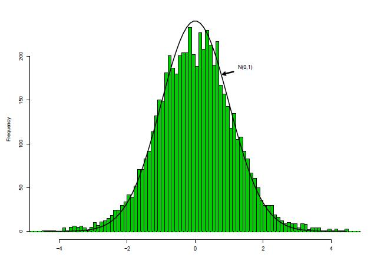
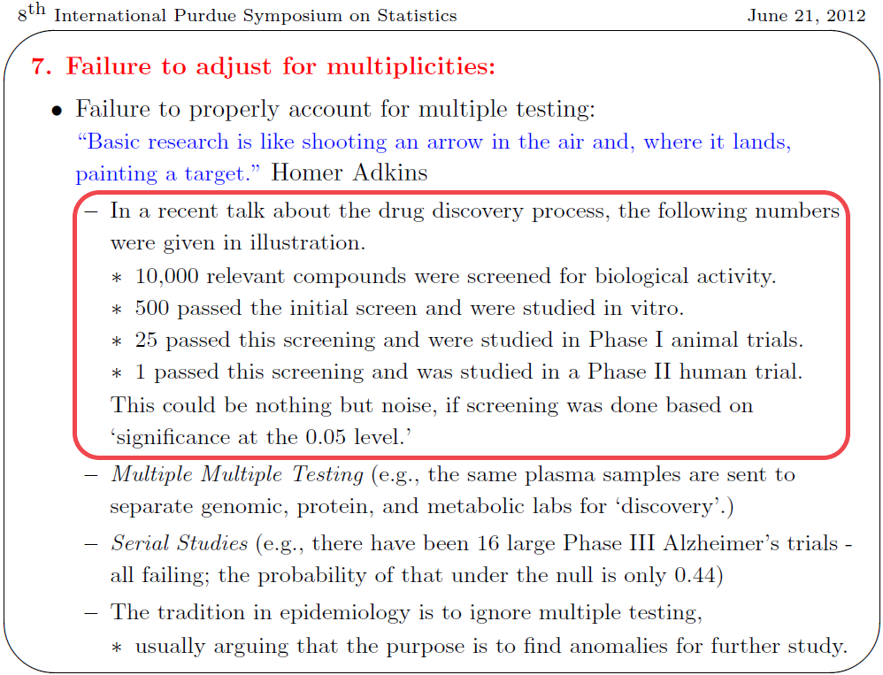

  

```{r setup, include=FALSE}
options(width=80)
library(knitr)
knitr::opts_chunk$set(echo = TRUE, warning = F, message = F, cache = TRUE)
knit_hooks$set(no.main = function(before, options, envir) {
    if (before) par(mar = c(4.1, 4.1, 1.1, 1.1))  # smaller margin on top
})
```

## Acknowledgement 

- I have used a few slides from Prof. Jim Berger's talk at Purdue Symposium in 2012 and Prof. Chris Genovese's talk on multiple testing. 

- Most of the other examples and texts are following Prof. Brad Efron's 'Large Scale Inference' book and website. 

## Example 

- Gene expression levels for $6033$ genes from $n_1 = 50$ normal controls and $n_2 = 52$ cancer patients. 
- Goal: Identify `differentially expressed' genes. 
- Test statistic for testing gene $i$: 
$$
z_i = \Phi^{-1}(F_{100}(t_i))
$$
where $t_i = \frac{\bar{x_i}(2) - \bar{x_i}(1)}{s_i}$ is $t$-statistic for testing gene $i$. 
- $H_{0i}: z_i \sim N(0,1)$.
- In reality, the dependence of the $Z$-values should impact the inference


## Data 

<div style="text-align:center" markdown="1">
{width=60%}
</div>

- `The shape of the histogram suggests the presence of certain interesting genes.' (Efron, 2008). 

## In R 

```{r qq}
load("prostz.Rda")
teststat = prostz
# cat(length(teststat),"\n") # correct data should have 6,033 entries
qqnorm(teststat)
qqline(teststat)
```


## In R 

```{R hist}
hist(teststat, breaks = 40, freq = F, col = "green")
curve(dnorm(x), col = 2, lty = 2, lwd = 2, add = TRUE)
```


## Large Scale Testing

- Suppose for the $i^{th}$ variable $x_{i}$ the two group means are $\theta_{i,1}$ and $\theta_{i,2}$.
$$
H_{0i}: \theta_{i,1} = \theta_{i,2} \text{ vs. } H_{1i}: \theta_{i,1} \neq \theta_{i,2}
$$
- If $H_{0i}$ is true, the group means $\bar{x}_{i,1}$ and  $\bar{x}_{i,1}$ should be close. 
- We can do an independent samples test for each of the $p$ variables.

- Note that, it is not necessary to compare the means via a **t-test** always. We can compare medians using **nonparametric tests** e.g. Mann-Whitney / variations using a Siegel-Tukey or an omnibus test using two-sample Kolmogorov-Smirnon test. 

## Multiple Testing Issues 

- We have a large number of tests: 6,033. If we use standard hypothesis testing at a 5% significance level, 5% of all tests will be falsely rejected (type 1 error) just by pure chance. 

- We need some kind of multiplicity control. 

- We will learn these, but first let's see the issue of multiplicity a little more closely. 


## Multiple testing 

-  Last time, we talked a little bit about multiple testing issues: and showed why the probability of a false rejection would grow as we test more and more hypotheses simultaneously. 

- Today, we will learn about methods to control these errors. 

- But first one quick reminder about P-values. 


## Jim Berger's talk at Purdue Symposium (JBPS'12)

<div style="text-align:center" markdown="1">
{width=80%}
</div>

-  *What do you think?*

## From the talk (JBPS'12)

>- "This isn't right. This isn't even wrong" - Wolfgang Pauli, on a
submitted paper. 

>- Actual correct answer: The chances are less than 5% of having
obtained the observed response or any more extreme response if
the therapy is not effective. 

## Multiplicity control

<div style="text-align:center" markdown="1">
{width=80%}
</div>


## From the talk 
<div style="text-align:center" markdown="1">
{width=85%}
</div>


## Example with Simulated Data {.small}

- 200 observations from a standard normal distribution. 
- I want to test $H_0: \theta_i = 0$ for each $i = 1, \ldots, 200$.

```{r, fig.asp = 0.5, echo = T}
set.seed(123)
z = rnorm(200, 0, 1);
hist(z, freq = F, ylim = c(0,0.7)); curve(dnorm, add = T)
```

## Testing 

-  Applying simple $Z$-test for each coordinate to test $H_0: \theta_i = 0$ vs. $H_1: \theta_i \ne 0$. 


```{r, echo = T}
rawp = 2*(1 - pnorm(abs(z)))
reject.indices <- (rawp < 0.05)
sum(reject.indices)
```

- We are falsely rejecting `r sum(reject.indices)` of them! Why? (note: 5\% of 200 = 10)

<!-- # ```{R} -->
<!-- # true.indices = c(rep(1, n*p1), rep(0, n*(1-p1))) -->
<!-- # (table(true.indices,reject.indices)) -->
<!-- # ``` -->

## False rejection 

- Naively comparing all $n$ P-values to the significance level $\alpha$ would mean that by purely random chance, $n \times \alpha$ of them will be falsely rejected. 

- Why? 

## False Discoveries 

- Under the $H_0$, p-values are (1-CDF)'s, i.e. each $p_i \sim U(0,1)$, as long as the test statistics have continuous distribution. 

- For example, for $Z$-test, $\text{P-value} = P_{Z \sim N(0,1)}(Z > z) = 1 - \Phi(z)$. 

-  This ensures that $P(p_i \le \alpha) = \alpha$, $i = 1, \ldots, m (\text{number of tests})$. 

- Probability of error = $\alpha$, Probability of not making an error = $1-\alpha$. 

- Assuming independence, probability of not making an error in $m$ tests: $(1-\alpha)^m$. 

- P(Making at least 1 error in $m$ tests) = $1-(1-\alpha)^m$.

- Now, if $\alpha \in (0,1)$, the sequence $1-(1-\alpha)^m \to 1$ as $m \to \infty$, in English, the probability of at least one false discovery goes to 1. 

## How does this grow? 

```{r, echo = T}
m = (0:100)
alpha = 0.05 
FWEP = 1 - (1-alpha)^m 
plot(m,FWEP,type = "l", ylab = "P(at least 1 false positive)")
```

## Multiple testing 

- Let $M_0$ be the number of null hypotheses that are true, $M_0 = M - M_1$. 

|           |$H_0$ acc |	$H_0$ rej | Total |
|-----------|----------|------------|-------|
|$H_0$ true |	U        | V          | $M_0$ |
|$H_0$ false|	T        | S          | $M_1$ |
|Total      |	M-R      | R          | $M$   |

- All quantities except $M$ and $R$ are unobserved. 

- The problem is to choose a testing procedure that will balance between *false positives* and *false negatives* 

- We can use subscript $i$ for the $i^{th}$ test, i.e. $R_i$ be the number of rejections by the $i^{th}$ test and $\sum R_i = R$. 


## How to choose a threshold? 

1. *Uncorrected testing*: 
   - Also called 'control per-comparison type I error' (PCER)
   - Gives $P(V_i>0) \le \alpha$ for each test $i = 1, \ldots, M$. 
   
2. *Control Familywise Type I Error (FWER)*
  -  e.g.: Bonferroni: use per-comparison significance level $\alpha/m$ 
  -  Guarantees $P(V> 0) \le \alpha$.

3. *Control False Discovery Rate (FDR)*
   - first defined by Benjamini and Hochberg (BH, 1995, 2000)
  -  Guarantees $FDR \equiv E(V/R) \le \alpha$. 

4.  Many developments since until now ... 

## Bonferroni Procedure

- $M$ hypothesis tests: $H_{0i}$ vs. $H_{1i}$ for $i = 1, \ldots, M$. 
- Let $p_1, \ldots, p_M$ be the p-values for these $M$ tests. 
- In our case $M = p$ (no. of genes)
- Bonferroni method: 
$$
\text{Reject null hypothesis } H_{0i} \text{ if } p_i \le \frac{\alpha}{M}
$$

- Outcome: The probability of falsely rejecting any null hypothesis is less than or equal to $\alpha$. 

## Bonferroni 

- Bonferroni's correction controls for the familywise error rate (FWER) instead of each $\alpha$. 
$$
FWER = P(\text{at least one false rejection}) \le \alpha 
$$

- Bonferroni leads to a stringent test, since $\alpha/M$ could be very small if we are carrying out a large number of $M$ tests simultaneously. 
- Proof of Bonferroni. 

## Proof 

- Boole's inequality: $P\{ \cup A_i \} \le \sum P\{ A_i \}$ 
- Now, let $I_0$ denote the indices of the true null hypotheses (for which $\theta_i$ is actually zero,) and there are $M_0$ of them. 
- Then, for Bonferroni:
$$
\text{FWER} = P\left\{ \cup_{I_0} \left( p_i \le \frac{\alpha}{M} \right) \right\} \le \sum_{I_0} P(p_i \le \frac{\alpha}{M}) = M_0 \frac{\alpha}{M} \le \alpha
$$


## Bonferroni in R 

- In R, we can apply the `p.adjust` function for this task. 

- `p.adjust` also has other useful methods such as "Benjamini-Hochberg False Discovery Rate control procedure".

```{r, echo = T}
rawp = 2 * (1 - pnorm(abs(teststat)))
selected  <- p.adjust(rawp, method = "bonferroni") <0.05
sum(selected)
```

- Bonferroni's correction leads to rejection of `r sum(selected)` tests - these genes significantly differ between two groups. 

- **Does it seem too small?**


## Benjamini-Hochberg 

- The Benjamini and Hochberg procedure for multiple testing offers an alternative to the Bonferroni's FWER control procedure, that offers a less stringent testing mechanism for high-dimensional data. 

-  The main idea is that instead of controlling the familywise error rate, i.e. the probability of at least one false rejection, we control the average proportion of false discoveries, also called false discovery rate or FDR. 

-  It turns out that the Benjamini-Hochberg method is less stringent and has many attractive properties for high-dimensional data and often recognized as a state-of-the-art procedure for multiple testing. We describe the testing procedure below. 

## Benjamini-Hochberg 

- Let $M_0$ be the number of null hypotheses that are true, $M_0 = M - M_1$. 

|           |$H_0$ acc |	$H_0$ rej | Total |
|-----------|----------|------------|-------|
|$H_0$ true |	U        | V          | $M_0$ |
|$H_0$ false|	T        | S          | $M_1$ |
|Total      |	M-R      | R          | $M$   |

- Define the false discovery proportion (FDP): 

$$
FDP = \begin{cases} 
V/R \text{ if } R > 0 \\
0 \text { otherwise}
\end{cases}
$$

## Benjamini-Hochberg procedure

- $M$ hypothesis tests We order the p-values in increasing order. 
$p_{(1)} \le \ldots \le p_{(M)}$. 

- *Benjamini-Hochberg Method* 
    Step 1.  For a given $\alpha$ find the largest $k$ such that
$$
p_{(k)} \le k \frac{\alpha}{M}
$$
    Step 2.  Then reject all $H_{0m}$ for $m = 1, \ldots, k$.
-  *Theorem* : 
$$
FDR = E(FDP) \le \frac{M_0}{M}\alpha \le \alpha
$$
-  *Outcome*: For a given significance level $\alpha$, the Benjamini Hochberg method bounds the false discovery rate.

## Benjamini-Hochberg in R

```{r, echo = T}
rawp = 2 * (1 - pnorm(abs(teststat)))
selected  <- p.adjust(rawp, method = "BH") <0.05
sum(selected)
```

- Benjamini-Hochberg method leads to rejection of `r sum(selected)
` tests - less stringent than Bonferroni. 

## Benjamini--Hochberg algorithm

- The best thing about this algorithm is that it is easy enough to code up, so that you don't have to depend on packages. 

- Let us look at the algorithm again ! 


<div style="text-align:center" markdown="1">
{width=100%}
</div>

## Benjamini--Hochberg algorithm 

```{R manual}
eval.bh <- function(y,q = 0.05)
{
  n <- length(y)
  pval <- 2*(1-pnorm(abs(y)))
  upper.bound <- (1:n)*q/n
  sorted.pval <- sort(pval, decreasing = FALSE)
  ind <- which(sorted.pval <= upper.bound)
  if(any(ind))
  {
    bh.thres <- sorted.pval[max(ind)]
  }else{
    bh.thres <- 0
  }
  bh.index <-(pval<=bh.thres)
  return(list(reject.indices = bh.index, sorted.p = sorted.pval, upper.bound = upper.bound))
}
```


## Try it 

```{r}
fit <- eval.bh(teststat, 0.05)
sum(fit$reject.indices)
```

## Proof 

-  The original proof that BH algorithm controls the false discovery rate at $\alpha$ was a long argument (See [Benjamini & Hochberg (1995).](http://engr.case.edu/ray_soumya/mlrg/controlling_fdr_benjamini95.pdf)), but Efron uses a Martingale argument that makes it into half a page. 

-  Here is another hand-wavy argument. 


## Plot first 50 sorted p-values 

```{r BH_proof, fig.asp = 0.6}
M <- length(teststat)
plot(fit$sorted.p[1:50], type = "p", pch = 10)
lines((1:50)*0.05/M)
```


# Another example

## Example from T-cell lymphoma {.build}

```{r,echo=TRUE, message=FALSE, warning=FALSE, cache=T}
## required for gene expression data classification example
require(ALL)
data(ALL)
dim(ALL)
```

## Simplifying features 

We are going to use the first three features. 

```{r, echo=TRUE}
resp <- gsub("B[0-9]", "B", ALL$BT) 
## B-cell tumors of type B, B1,B2, T, T1, T2 
resp <- factor(gsub("T[0-9]", "T", resp))
xmat <- t(exprs(ALL))
mydata <- data.frame(y = resp,x1 = xmat[,1],x2=xmat[,2],x3=xmat[,3])
head(mydata,n=3)
```

## Further Analysis 

-  Let's look at the results of molecular biology testing for the 128 samples:

```{r, echo = T}
table(ALL$mol.biol)
```

- Not all levels are frequent ! 

## Filter 

Ignoring the samples which came back negative on this test (NEG), most have been classified as (BCR/ABL) or (ALL1/AF4).

For the purposes of this example, we are only interested in these two subgroups, so we will create a filtered version of the dataset using this as a selection criteria:

```{r, echo = T}
eset <- ALL[, ALL$mol.biol %in% c("BCR/ABL", "ALL1/AF4")]
dim(eset)
```


## How do we analyze this data?

- We have the expression levels 12,625 genes for 47 samples. 
- We also have a factor `ALL$mol.biol` that has two levels: BCR/ABL and ALL1/AF4. 
- We can ask for which genes, the gene expression values differ between these two subgroups? 
- Two sample tests !

## Simple test 

- One idea would be use a two sample t-test for equality of group mean for each of the 12,625 genes. 
- The `mt.teststat` function from the `multtest` library does this for you. 

```{r, echo = T, cache=T}
require(multtest)
all.mat = exprs(eset)
all.cl <- factor(as.character(eset$mol.biol))
teststat = mt.teststat(all.mat,all.cl,test="t")
```

- The two datasets `all.mat` and `all.cl` are all you need. 
- `all.mat` has the gene expression values and `all.cl` gives the class labbels. 
- mt.teststat {multtest}: **Package for computing test statistics for each row of a data frame**.

## Why t-test? 

- These functions provide a convenient way to compute test statistics, e.g., two-sample Welch t-statistics, **Wilcoxon statistics**, F-statistics, paired t-statistics, block F-statistics, for each row of a data frame.
- Should we use a t-test or a different test? 
- Depends on whether you believe in normality assumption for each test or have sufficient data for CLT to kick in. 

## Visualize data {.small}

- QQplot/overlaid histogram: visual inspection of normality. Departure from diagonal (QQ) or bell-shape suggests presence of signals. 

```{r, echo = F}
par(mfrow=c(1,2))
qqnorm(teststat, ylim = c(-5,5))
qqline(teststat)
hist(teststat, breaks = 30, col = "red", freq = F, xlim = c(-5,5), ylim = c(0,0.5))
curve(dnorm(x), lty = 2, lwd = 2, add=TRUE)
curve(dnorm(x, mean = mean(teststat), sd = sd(teststat)), lty = 3, lwd = 2, add=TRUE)
```

- Histogram and N(0,1) density different on the tails - a few interesting genes?

## Multiple Testing

-  You need to test for significance all the 12,625 rows/genes, get P-values for each of them and then apply multiple testing correction as shown above. 
-  Perform at least two different tests and two different multiplicity corrections, e.g. Bonferroni and Benjamini-Hochberg corrections. 

## Bonferroni 

- Recall: Bonferroni's correction controls for the familywise error rate (FWER) instead of each $\alpha$. 
$$
FWER = P(\text{at least one false rejection}) \le \alpha 
$$


```{r, echo = T}
rawp = 2 * (1 - pnorm(abs(teststat)))
selected  <- p.adjust(rawp, method = "bonferroni") <0.05
sum(selected)
```

- Bonferroni's correction leads to rejection of `r sum(selected)
` tests - these genes significantly differ between two groups


## Benjamini-Hochberg in R

```{r, echo = T}
rawp = 2 * (1 - pnorm(abs(teststat)))
selected  <- p.adjust(rawp, method = "BH") <0.05
sum(selected)
```

## Using package 

- `multtest' package also has own functions for applying multiple testing correction. 

```{r}
## Multiple testing 
library(multtest)
rawp = 2 * (1 - pnorm(abs(teststat)))
adjusted = mt.rawp2adjp(rawp, c("Bonferroni", "BH"))
rejected <- mt.reject(adjusted$adj[order(adjusted$index), ], 0.05)
rejected$r
```


## Using package 

- Has many, many procedures built-in: 

```{r}
adjusted = mt.rawp2adjp(rawp, c("Bonferroni", "Holm", "Hochberg", "SidakSS", 
                                "SidakSD", "BH", "BY", "ABH", "TSBH"))
rejected <- mt.reject(adjusted$adj[order(adjusted$index), ], 0.05)
rejected$r
```

- I'll talk about one more procedure, here abbreviated as "BY"

## Dependence?

-  The Benjamini--Hochberg procedure assumes that the P-values (and the underlying test statistics) are independent of each other. 

- This is not always true in real life, and as a result the outcomes of Benjamini-Hochberg often tend to be anti-conservative. 

-  Benjamini & Yekutieli (2001) proposed a modification for the BH procedure that takes dependence into account. 

-  You can apply their approach by simply changing `method = BH` to `method = BY` in your `p.adjust` function. 

- You should investigate whether there is a strong dependence in your data (i.e. dependence between genes), and whether applying BY instead of BH changes your conclusion. 


## Benjamini-Yekutieli 

- BH is a lot more liberal than FWER control.
- This is good for large M; for small M, the story is different, because FWER is actually reasonably workable for small problems.
- BH is nice, elegant and useful, it does have drawbacks: 
- One is the independence assumption. You can drop independence if you use:

$$
p(i) \le \frac{iq}{M}\frac{1}{\sum_{j=1}^{i} \frac{1}{j}}
$$
- $M$ is the total number of tests, $q$ is desired control. The correction factor can be large, i.e. the test could be conservative. 


## Benjamini-Yekutieli 


```{r, echo = T}
rawp = 2 * (1 - pnorm(abs(teststat)))
selected  <- p.adjust(rawp, method = "BY") <0.05
sum(selected)
```

## Literature for Multiple Testing

-  The original paper by Benjamini & Hochberg is here: [Benjamini & Hochberg (1995).](http://engr.case.edu/ray_soumya/mlrg/controlling_fdr_benjamini95.pdf).

-  Manual for the R package `multtest`: [multtest manual.](https://www.bioconductor.org/packages/release/bioc/manuals/multtest/man/multtest.pdf)

- For more details about large scale inference including multiple testing, an excellent reference is Prof. Bradley Efron's monograph on this subject. You can download the pdf copy of the book from Prof. Efron's webpage here: 
[Large Scale Inference - Efron (2010)](https://statweb.stanford.edu/~ckirby/brad/LSI/monograph_CUP.pdf). The first 4 chapters are pertinent for this project and the whole book is a very nice read if you want to learn about large scale inferences. 


<!-- ## Nonparametric test -->

<!-- -  We can use the `mt.teststat` function from the `multtest` package as shown above  but choose a different test other than the Student's `t` test.  -->
<!-- -  Since we know how to do any nonparametric test covered in class for two independent samples, we can use them on each gene and calculate P-values for each gene, using a for loop.  -->

<!-- ```{r, echo = T} -->
<!-- dim(all.mat) -->
<!-- dim(all.cl) -->
<!-- str(all.cl) -->
<!-- ``` -->

<!-- A simple two-sample nonparametric test for the first row, i.e. one single gene is shown below:  -->

<!-- ```{r, echo = T} -->
<!-- all.mat.af4 = all.mat[,all.cl=='ALL1/AF4'] -->
<!-- all.mat.abl = all.mat[,all.cl=='BCR/ABL'] -->

<!-- wilcox.test(all.mat.af4[1,],all.mat.abl[1,]) -->
<!-- ``` -->

